

[Version 0.2]{.c64 .c48 .c10 .c66}

[Introduction]{.c1} {#h.beei20oq92lz .c7}
===================

This document is intended for anyone and everyone who wants to start
programming for B.R.E.A.D., regardless of your level of prior
programming experience. Theoretically, if you read through this doc and
complete at least some of the projects you should be ready to start on
one of the issues in the codebase. However, we know that's not how
learning works in real life, so [always]{.c10} ask one of the other
programmers if you have a question, and don't feel ashamed about having
to Google something. Or everything. (And don't be scared of the page
count. There's pictures)

[]{.c3}

[[Introduction](#h.beei20oq92lz){.c23}]{.c18}[        ]{.c18}[[1](#h.beei20oq92lz){.c23}]{.c18}

[[Installation](#h.acwf5hb84t9o){.c23}]{.c18}[        ]{.c18}[[5](#h.acwf5hb84t9o){.c23}]{.c18}

[VSCode](#h.q7uho3tx65pk){.c23}        [5](#h.q7uho3tx65pk){.c23}

[Windows](#h.hb33glwl1ayf){.c23}        [5](#h.hb33glwl1ayf){.c23}

[Mac and
Linux](#h.tlni2c2198n8){.c23}        [13](#h.tlni2c2198n8){.c23}

[Git](#h.8srzscq6dz8m){.c23}        [14](#h.8srzscq6dz8m){.c23}

[For Beginning
Users](#h.s0cn5o51u2sx){.c23}        [14](#h.s0cn5o51u2sx){.c23}

[For All
Users](#h.lgzfkulxtdyg){.c23}        [14](#h.lgzfkulxtdyg){.c23}

[For People Who Want to Feel Like a
Hacker](#h.hhbj6u8g3ezl){.c23}        [14](#h.hhbj6u8g3ezl){.c23}

[Cloning the
Repository](#h.gaefpbrntykl){.c23}        [15](#h.gaefpbrntykl){.c23}

[From GitHub
Desktop](#h.91b3jbe0rtg3){.c23}        [15](#h.91b3jbe0rtg3){.c23}

[From Git Command
Line](#h.85p71eflro6f){.c23}        [18](#h.85p71eflro6f){.c23}

[Open the Codebase in
VSCode](#h.jjjkxt5jgz8p){.c23}        [18](#h.jjjkxt5jgz8p){.c23}

[Windows](#h.ixvbx9e570aq){.c23}        [18](#h.ixvbx9e570aq){.c23}

[Mac](#h.5byy2jutllpi){.c23}        [20](#h.5byy2jutllpi){.c23}

[[Java: The
Basics](#h.3x092ok4scn0){.c23}]{.c18}[        ]{.c18}[[21](#h.3x092ok4scn0){.c23}]{.c18}

[Functions and
Methods](#h.vo45lcwc6a4g){.c23}        [21](#h.vo45lcwc6a4g){.c23}

[Function vs.
Method](#h.6q5rc2us9mo2){.c23}        [21](#h.6q5rc2us9mo2){.c23}

[Creating a
Function](#h.23i39brr0wet){.c23}        [21](#h.23i39brr0wet){.c23}

[Return Types](#h.t41z0xtxfw3t){.c23}        [22](#h.t41z0xtxfw3t){.c23}

[Arguments](#h.bk3szcq88cwv){.c23}        [22](#h.bk3szcq88cwv){.c23}

[Public vs. Protected vs.
Private](#h.mu64m0i1wryi){.c23}        [22](#h.mu64m0i1wryi){.c23}

[Objects and
Classes](#h.ttmujtaz8ldr){.c23}        [23](#h.ttmujtaz8ldr){.c23}

[An Analogy](#h.9ltpmm3816m){.c23}        [23](#h.9ltpmm3816m){.c23}

[Defining a
Class](#h.bk45aai8z8m0){.c23}        [23](#h.bk45aai8z8m0){.c23}

[Creating an Instance of a
Class](#h.8dhcvog7gnqb){.c23}        [24](#h.8dhcvog7gnqb){.c23}

[Using Methods Inherited from a
Class](#h.nfm8wpwlyqjc){.c23}        [25](#h.nfm8wpwlyqjc){.c23}

[Common Error
Messages](#h.r5ji7aoazkw3){.c23}        [26](#h.r5ji7aoazkw3){.c23}

[Null Pointer
Exception](#h.vjg7i6cd3k5i){.c23}        [26](#h.vjg7i6cd3k5i){.c23}

[Invalid
Syntax](#h.ducqzztriw14){.c23}        [27](#h.ducqzztriw14){.c23}

[Constructor
Undefined](#h.ctio58gu1fn8){.c23}        [28](#h.ctio58gu1fn8){.c23}

[[Robot Code: An
Overview](#h.49912dujrvc8){.c23}]{.c18}[        ]{.c18}[[29](#h.49912dujrvc8){.c23}]{.c18}

[An Analogy](#h.cbwj92kz6lw3){.c23}        [29](#h.cbwj92kz6lw3){.c23}

[Subsystems](#h.89rbi9vftcml){.c23}        [30](#h.89rbi9vftcml){.c23}

[How to Create a
Subsystem](#h.6fyeoglw22fc){.c23}        [31](#h.6fyeoglw22fc){.c23}

[Commands](#h.pq8fh8lvuihl){.c23}        [31](#h.pq8fh8lvuihl){.c23}

[How to Create a
Command](#h.lcqpbdfyhdtt){.c23}        [32](#h.lcqpbdfyhdtt){.c23}

[Command
Groups](#h.1rnnndsgllkr){.c23}        [35](#h.1rnnndsgllkr){.c23}

[How to Create a Command
Group](#h.shpsx2rxolrx){.c23}        [35](#h.shpsx2rxolrx){.c23}

[PID](#h.m5be45bx1jfu){.c23}        [36](#h.m5be45bx1jfu){.c23}

[Shuffleboard](#h.rxm7656k4ny4){.c23}        [38](#h.rxm7656k4ny4){.c23}

[Auto](#h.408xql4ohk1y){.c23}        [38](#h.408xql4ohk1y){.c23}

[Auto Actions](#h.nx0a2fo0a8y5){.c23}        [39](#h.nx0a2fo0a8y5){.c23}

[Auto Action
Groups](#h.2ilz3d4f4zfq){.c23}        [39](#h.2ilz3d4f4zfq){.c23}

[AutoMotion](#h.n0xlq5ubo40g){.c23}        [39](#h.n0xlq5ubo40g){.c23}

[[Robot Code: In
Detail](#h.vjkrpzce0oy){.c23}]{.c18}[        ]{.c18}[[40](#h.vjkrpzce0oy){.c23}]{.c18}

[Robot](#h.gb534roervmi){.c23}        [40](#h.gb534roervmi){.c23}

[Operator Input
(OI)](#h.ydl39dx5lgpq){.c23}        [41](#h.ydl39dx5lgpq){.c23}

[RobotConfig](#h.yp1e8ncmejrl){.c23}        [41](#h.yp1e8ncmejrl){.c23}

[Important Things to
Understand](#h.dvwnmqwmmn19){.c23}        [42](#h.dvwnmqwmmn19){.c23}

[Buttons and the OI
Class](#h.jxzhyy74hbrf){.c23}        [42](#h.jxzhyy74hbrf){.c23}

[Getting Joystick
Values](#h.y4uta5hxycpn){.c23}        [44](#h.y4uta5hxycpn){.c23}

[[Actually Writing
Code](#h.vb254lidm854){.c23}]{.c18}[        ]{.c18}[[46](#h.vb254lidm854){.c23}]{.c18}

[Git: An Abbreviated Introduction to Version
Control](#h.k82o4atkmy8k){.c23}        [46](#h.k82o4atkmy8k){.c23}

[What is Git and
GitHub?](#h.lxj4ea5f3on9){.c23}        [46](#h.lxj4ea5f3on9){.c23}

[What is a
commit?](#h.ckdu957wvlp7){.c23}        [46](#h.ckdu957wvlp7){.c23}

[What are
branches?](#h.6qo2tlr0wy1u){.c23}        [48](#h.6qo2tlr0wy1u){.c23}

[Command line git (For advanced
users)](#h.984m5lnqbof){.c23}        [49](#h.984m5lnqbof){.c23}

[Contributing to the
Codebase](#h.xt85ahnaduwi){.c23}        [50](#h.xt85ahnaduwi){.c23}

[Testing Code](#h.amyax4dc0zer){.c23}        [50](#h.amyax4dc0zer){.c23}

[Writing unit
tests](#h.kt1fkmxbq663){.c23}        [50](#h.kt1fkmxbq663){.c23}

[Build and Deploy with VSCode and
WPILib](#h.6p3m7ade27np){.c23}        [51](#h.6p3m7ade27np){.c23}

[Build and Deploy with
Gradle](#h.agj4p6ccl6ga){.c23}        [52](#h.agj4p6ccl6ga){.c23}

[[Project
Index](#h.fselraj97ecd){.c23}]{.c18}[        ]{.c18}[[53](#h.fselraj97ecd){.c23}]{.c18}

[Creating and Using a
Class](#h.97uvxf1va9xn){.c23}        [53](#h.97uvxf1va9xn){.c23}

[Difficulty: \*](#h.qej7qwbyow5){.c23}        [53](#h.qej7qwbyow5){.c23}

[Summary](#h.d6ipha6cqyrn){.c23}        [53](#h.d6ipha6cqyrn){.c23}

[Instructions](#h.todgdocy5jx8){.c23}        [53](#h.todgdocy5jx8){.c23}

[Resources](#h.8pzt7tdrjr37){.c23}        [53](#h.8pzt7tdrjr37){.c23}

[DNA to RNA](#h.mpa2vpi5grwv){.c23}        [54](#h.mpa2vpi5grwv){.c23}

[Difficulty:
\*](#h.up7lheb10tfk){.c23}        [54](#h.up7lheb10tfk){.c23}

[Summary](#h.wdguxa7dcu24){.c23}        [54](#h.wdguxa7dcu24){.c23}

[Instructions](#h.64micom6yx4x){.c23}        [54](#h.64micom6yx4x){.c23}

[Resources](#h.18cpj047fzho){.c23}        [54](#h.18cpj047fzho){.c23}

[Credit Card
System](#h.og1evh829mfo){.c23}        [55](#h.og1evh829mfo){.c23}

[Difficulty:\*\*](#h.j815vp5pectp){.c23}        [55](#h.j815vp5pectp){.c23}

[Summary](#h.9sfd2s9am0nj){.c23}        [55](#h.9sfd2s9am0nj){.c23}

[Instructions](#h.iw7rd2dv6p32){.c23}        [55](#h.iw7rd2dv6p32){.c23}

[Resources](#h.mgplx6mf7p9t){.c23}        [55](#h.mgplx6mf7p9t){.c23}

[Lines](#h.o586gttxgfo8){.c23}        [56](#h.o586gttxgfo8){.c23}

[Difficulty:\*\*](#h.m42228xx0qvc){.c23}        [56](#h.m42228xx0qvc){.c23}

[Summary](#h.d1r7vbmmtr3c){.c23}        [56](#h.d1r7vbmmtr3c){.c23}

[Instructions](#h.n3df57430nit){.c23}        [56](#h.n3df57430nit){.c23}

[Resources](#h.xx0k4cl5x3mw){.c23}        [56](#h.xx0k4cl5x3mw){.c23}

[Driving](#h.l2orvunxhhbu){.c23}        [57](#h.l2orvunxhhbu){.c23}

[Difficulty:
\*\*\*](#h.9yr0dkj0sd0f){.c23}        [57](#h.9yr0dkj0sd0f){.c23}

[Summary](#h.u2gaebqfy3f0){.c23}        [57](#h.u2gaebqfy3f0){.c23}

[Instructions](#h.9bjvdzpqc5os){.c23}        [57](#h.9bjvdzpqc5os){.c23}

[Resources](#h.b4wokm1wvc7){.c23}        [58](#h.b4wokm1wvc7){.c23}

[Elevator](#h.fgsbhq4ypsqi){.c23}        [58](#h.fgsbhq4ypsqi){.c23}

[Difficulty:\*\*\*](#h.a74hwps8666f){.c23}        [58](#h.a74hwps8666f){.c23}

[Summary](#h.bctnkvq437pe){.c23}        [58](#h.bctnkvq437pe){.c23}

[Instructions](#h.szi2wu6l5a36){.c23}        [58](#h.szi2wu6l5a36){.c23}

[Resources](#h.v1rsgernl0jz){.c23}        [59](#h.v1rsgernl0jz){.c23}

[Command
Square](#h.sr55z4hn3bxs){.c23}        [59](#h.sr55z4hn3bxs){.c23}

[Difficulty:\*\*\*\*](#h.9kx78aqjf1o8){.c23}        [59](#h.9kx78aqjf1o8){.c23}

[Summary](#h.4npxto54aq3a){.c23}        [59](#h.4npxto54aq3a){.c23}

[Instructions](#h.6g0frz6n454m){.c23}        [59](#h.6g0frz6n454m){.c23}

[Resources](#h.qrlvbbk5el0t){.c23}        [60](#h.qrlvbbk5el0t){.c23}

[Placement](#h.e9o91oi8t9dt){.c23}        [60](#h.e9o91oi8t9dt){.c23}

[Difficulty:\*\*\*\*\*](#h.935fr5ku62wo){.c23}        [60](#h.935fr5ku62wo){.c23}

[Summary](#h.5leqkdq1me8v){.c23}        [60](#h.5leqkdq1me8v){.c23}

[Instructions](#h.3w18d1rtnbx3){.c23}        [60](#h.3w18d1rtnbx3){.c23}

[Resources](#h.89ahv0l6ms1o){.c23}        [61](#h.89ahv0l6ms1o){.c23}

[Jump In!](#h.fo2nzrb0r1v9){.c23}        [61](#h.fo2nzrb0r1v9){.c23}

[]{.c3}

------------------------------------------------------------------------

[]{.c3}

[Installation]{.c1} {#h.acwf5hb84t9o .c7}
===================

VSCode {#h.q7uho3tx65pk .c7}
------

### Windows^[\[a\]](#cmnt1){#cmnt_ref1}[\[b\]](#cmnt2){#cmnt_ref2}[\[c\]](#cmnt3){#cmnt_ref3}^ {#h.hb33glwl1ayf .c7}

1.  Download and install VSCode from
    [[https://code.visualstudio.com/](https://www.google.com/url?q=https://code.visualstudio.com/&sa=D&ust=1547844679833000){.c23}]{.c12}
2.  Install JDK 11 from
    [[here](https://www.google.com/url?q=https://www.oracle.com/technetwork/java/javase/downloads/jdk11-downloads-5066655.html&sa=D&ust=1547844679833000){.c23}]{.c12}\
     [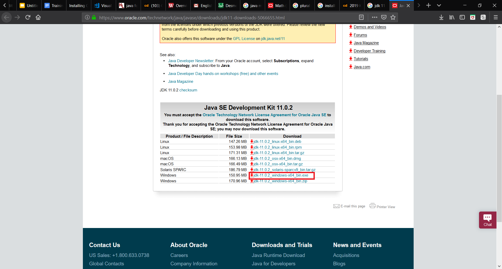]{style="overflow: hidden; display: inline-block; margin: 0.00px 0.00px; border: 0.00px solid #000000; transform: rotate(0.00rad) translateZ(0px); -webkit-transform: rotate(0.00rad) translateZ(0px); width: 382.57px; height: 348.09px;"}
3.  Navigate to the folder you installed the JDK to and open the 'Bin'
    folder. Copy the
    path[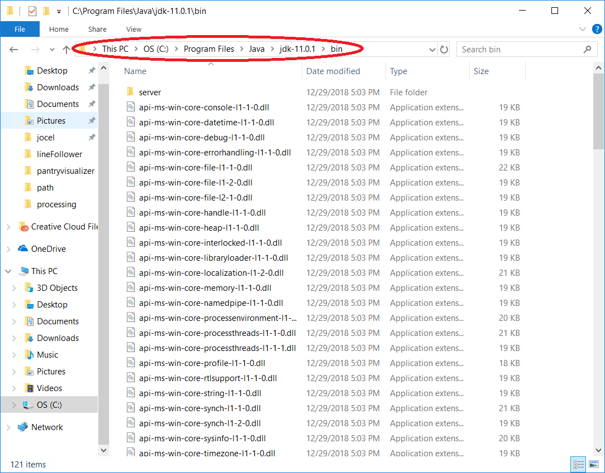]{style="overflow: hidden; display: inline-block; margin: 0.00px 0.00px; border: 0.00px solid #000000; transform: rotate(0.00rad) translateZ(0px); -webkit-transform: rotate(0.00rad) translateZ(0px); width: 624.00px; height: 489.33px;"}
4.  [Open the 'System properties' control panel and click on
    'Environment Variables...']{.c3}

[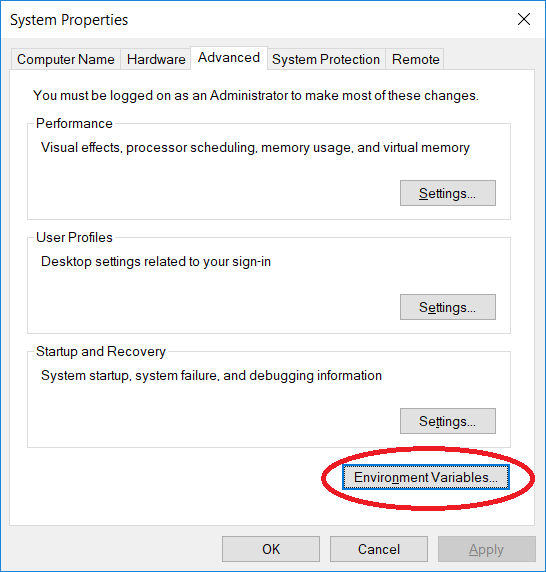]{style="overflow: hidden; display: inline-block; margin: 0.00px 0.00px; border: 0.00px solid #000000; transform: rotate(0.00rad) translateZ(0px); -webkit-transform: rotate(0.00rad) translateZ(0px); width: 330.18px; height: 346.50px;"}

5.  [Select 'Path' under 'System Variables']{.c3}
6.  [Click 'Edit']{.c3}

[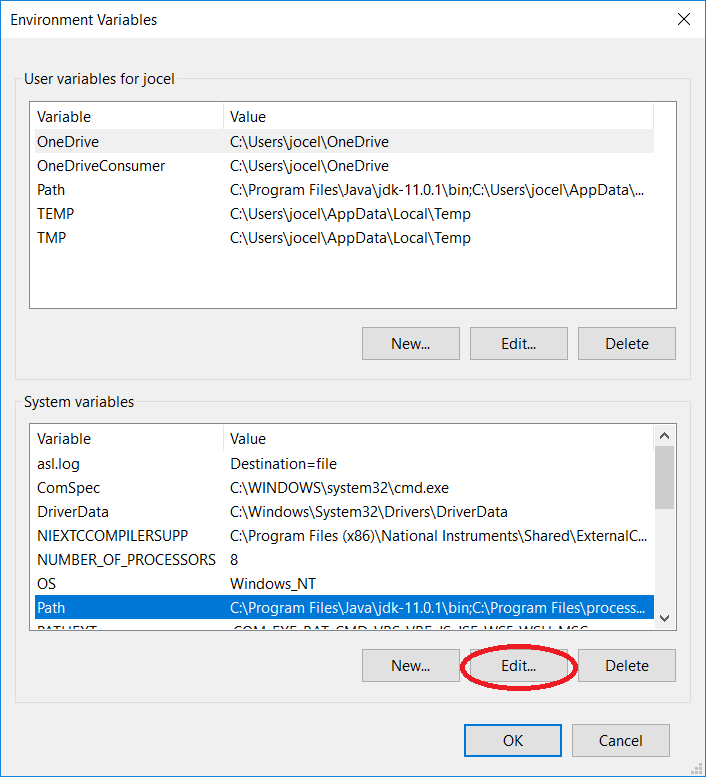]{style="overflow: hidden; display: inline-block; margin: 0.00px 0.00px; border: 0.00px solid #000000; transform: rotate(0.00rad) translateZ(0px); -webkit-transform: rotate(0.00rad) translateZ(0px); width: 336.13px; height: 370.50px;"}

7.  [Click 'New']{.c3}

[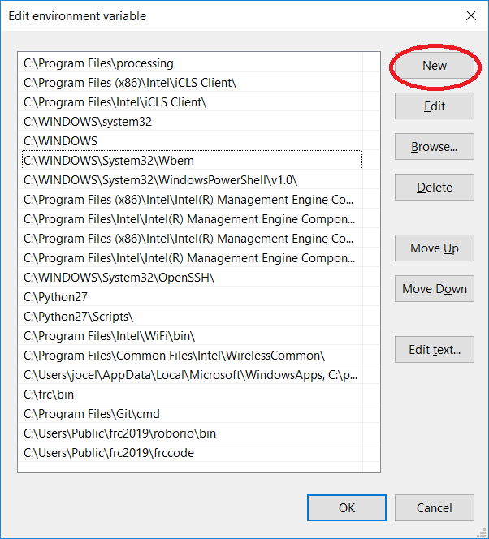]{style="overflow: hidden; display: inline-block; margin: 0.00px 0.00px; border: 0.00px solid #000000; transform: rotate(0.00rad) translateZ(0px); -webkit-transform: rotate(0.00rad) translateZ(0px); width: 305.50px; height: 336.96px;"}

8.  Paste the path to the JDK bin folder and hit
    enter[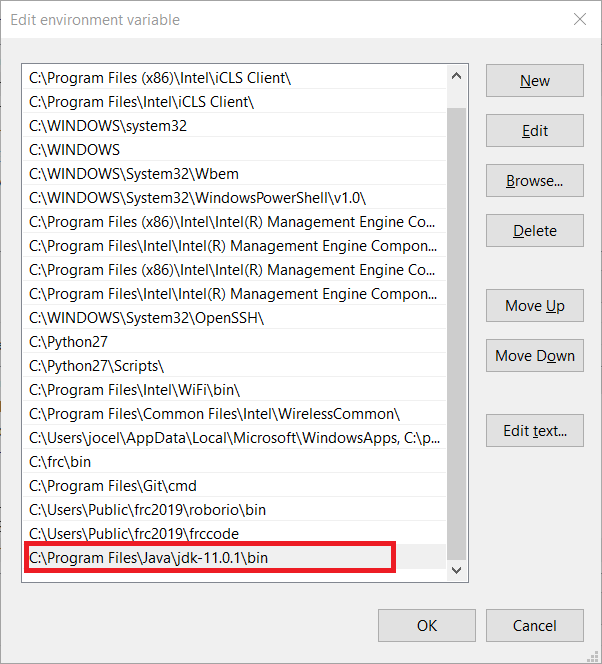]{style="overflow: hidden; display: inline-block; margin: 0.00px 0.00px; border: 0.00px solid #000000; transform: rotate(0.00rad) translateZ(0px); -webkit-transform: rotate(0.00rad) translateZ(0px); width: 282.41px; height: 311.50px;"}
9.  Click the 'Move Up' button until what you just pasted is at the top
    of the
    path[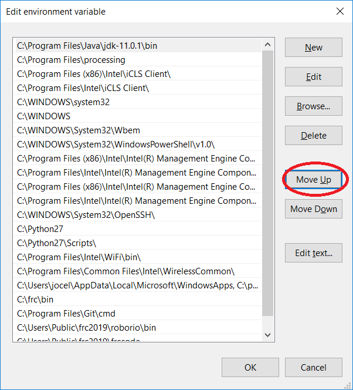]{style="overflow: hidden; display: inline-block; margin: 0.00px 0.00px; border: 0.00px solid #000000; transform: rotate(0.00rad) translateZ(0px); -webkit-transform: rotate(0.00rad) translateZ(0px); width: 318.32px; height: 351.50px;"}

<!-- -->

1.  [If later Gradle gives the error "could not determine Java version
    from 'blah', delete all other Java paths from your Path]{.c3}

<!-- -->

10. [Click the 'Ok' button on each open window]{.c3}
11. [Restart your computer]{.c3}
12. [Open VSCode]{.c3}
13. Click on the 'Extensions' tab
    (Ctrl+Shift+X)[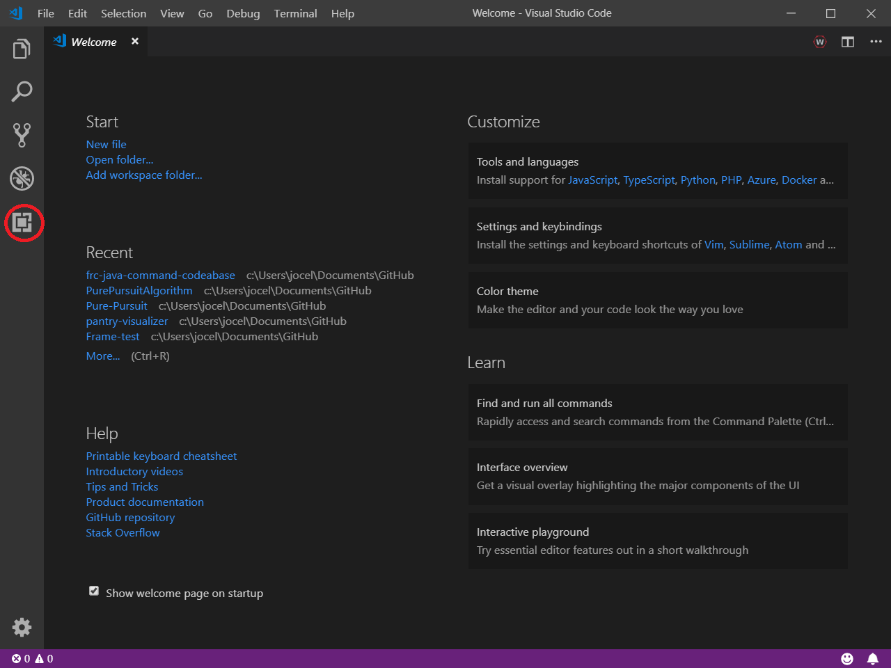]{style="overflow: hidden; display: inline-block; margin: 0.00px 0.00px; border: 0.00px solid #000000; transform: rotate(0.00rad) translateZ(0px); -webkit-transform: rotate(0.00rad) translateZ(0px); width: 624.00px; height: 468.00px;"}
14. Search for 'Java' and install the 'Java Extension Pack' from
    Microsoft[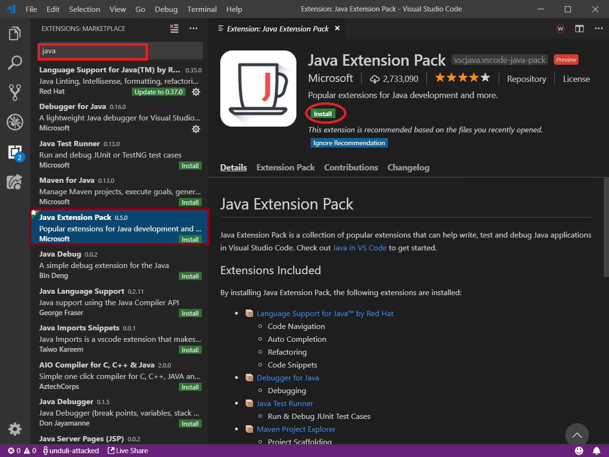]{style="overflow: hidden; display: inline-block; margin: 0.00px 0.00px; border: 0.00px solid #000000; transform: rotate(0.00rad) translateZ(0px); -webkit-transform: rotate(0.00rad) translateZ(0px); width: 624.00px; height: 468.00px;"}
15. Search for 'C++' and install the first extension that pops up,
    "C/C++" from
    Microsoft[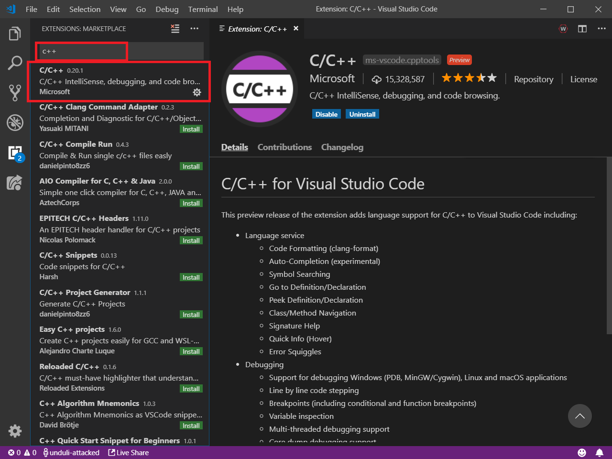]{style="overflow: hidden; display: inline-block; margin: 0.00px 0.00px; border: 0.00px solid #000000; transform: rotate(0.00rad) translateZ(0px); -webkit-transform: rotate(0.00rad) translateZ(0px); width: 624.00px; height: 468.00px;"}

<!-- -->

1.  [We need to install C++ even though we use Java because WPILib is
    bad]{.c3}

<!-- -->

16. Search for and install
    'WPILib'[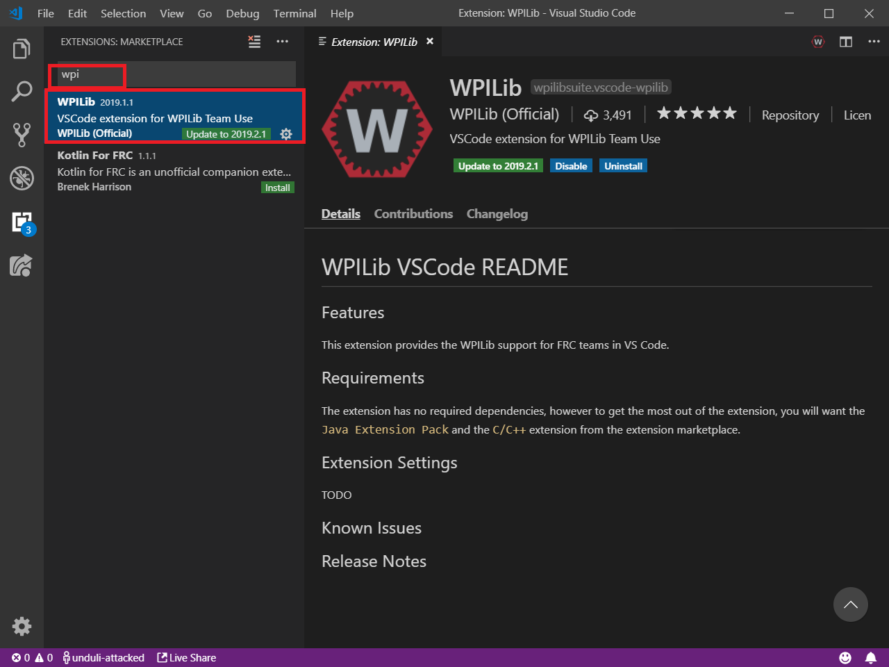]{style="overflow: hidden; display: inline-block; margin: 0.00px 0.00px; border: 0.00px solid #000000; transform: rotate(0.00rad) translateZ(0px); -webkit-transform: rotate(0.00rad) translateZ(0px); width: 624.00px; height: 468.00px;"}
17. [Reload VSCode with Command palette (ctrl + shift + p) =\> Reload or
    by clicking on the Reload button.]{.c3}
18. Test building code per [[Build and Deploy with VSCode and
    WPILib](#h.6p3m7ade27np){.c23}]{.c12} or [[Build and Deploy with
    Gradle](#h.agj4p6ccl6ga){.c23}]{.c12}

[]{.c3}

### [Mac and Linux]{.c16 .c10} {#h.tlni2c2198n8 .c7}

Follow the instructions on
[[ScreenStepsLive](https://www.google.com/url?q=https://wpilib.screenstepslive.com/s/currentCS/m/java/l/1027503-installing-c-and-java-development-tools-for-frc&sa=D&ust=1547844679838000){.c23}]{.c12} to
install and setup VSCode with WPILib.

[]{.c3}

[Git]{.c37 .c18} {#h.8srzscq6dz8m .c7}
----------------

[Note: If you already have Git on your computer, skip to
']{.c42}[[Cloning the Repository](#h.gaefpbrntykl){.c23}]{.c12
.c42}['.]{.c3 .c42}

[]{.c3 .c42}

### [For Beginning Users]{.c16 .c10} {#h.s0cn5o51u2sx .c7}

Install GitHub Desktop from
[[here](https://www.google.com/url?q=https://desktop.github.com/&sa=D&ust=1547844679839000){.c23}]{.c12}[ and
log in or create an account. ]{.c3}

[This provides a simple user interface for Git.]{.c3}

[]{.c3}

### [For All Users]{.c16 .c10} {#h.lgzfkulxtdyg .c7}

Install Git for command line from
[[here](https://www.google.com/url?q=https://git-scm.com/downloads&sa=D&ust=1547844679840000){.c23}]{.c12}.
(Mac users should use
[[homebrew](https://www.google.com/url?q=https://brew.sh/&sa=D&ust=1547844679840000){.c23}]{.c12}[)]{.c3}

[If you feel confident in you command line abilities, you can do
everything git-related through this. Otherwise, it is recommended that
you use GitHub Desktop.]{.c3}

[]{.c3}

### [For People Who Want to Feel Like a Hacker]{.c16 .c10} {#h.hhbj6u8g3ezl .c7}

[The following git commands are essential \-- you will likely use them
daily]{.c3}

[]{#t.56547eee4fa27a1761dc11be6abb6240f4d6b66a}[]{#t.0}

+-----------------------------------------------------------------------+
| [git                                                                  |
| ]{.c29}[clone]{.c46}[ https://github.com/bread5940/frc-java-command-c |
| odebase\                                                              |
| git branch ]{.c29}[\# List all the branches]{.c54 .c48}[\             |
| git checkout master ]{.c29}[\# \"checkout\" a branch]{.c54 .c48}[\    |
| git branch -b MyNewFeature-MyName-02.03.01 ]{.c29}[\# Create a new    |
| branch based on the one currently checked out]{.c48 .c54}[\           |
| git status ]{.c29}[\# See what changes you\'ve made]{.c54 .c48}[\     |
| git add -A ]{.c29}[\# Stage the changes you\'ve made]{.c54 .c48}[\    |
| git commit -m ]{.c29}[\"I made some changes\"]{.c57 .c48}[\           |
| git push ]{.c29}[\# to push your changes to the default remote]{.c54  |
| .c48}[\                                                               |
| git reset \--hard ]{.c29}[\# to hard revert all your uncommitted      |
| changes - be careful with this]{.c54 .c48}[\                          |
| git reset \--hard origin ]{.c29}[\# When you\'re just done with life  |
| and want to nuke everything back to the way it is in your             |
| remote]{.c54 .c48}                                                    |
+-----------------------------------------------------------------------+

[]{.c3}

[]{.c3}

[Cloning the Repository]{.c37 .c18} {#h.gaefpbrntykl .c7}
-----------------------------------

### [From GitHub Desktop]{.c16 .c10} {#h.91b3jbe0rtg3 .c7}

1.  [Open GitHub Desktop]{.c3}
2.  Click on the 'Repositories' dropdown in the top left
    corner[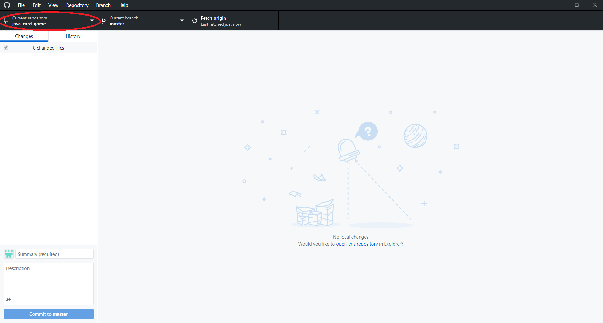]{style="overflow: hidden; display: inline-block; margin: 0.00px 0.00px; border: 0.00px solid #000000; transform: rotate(0.00rad) translateZ(0px); -webkit-transform: rotate(0.00rad) translateZ(0px); width: 624.00px; height: 334.67px;"}
3.  From the 'Add' dropdown, select 'Clone
    repository'[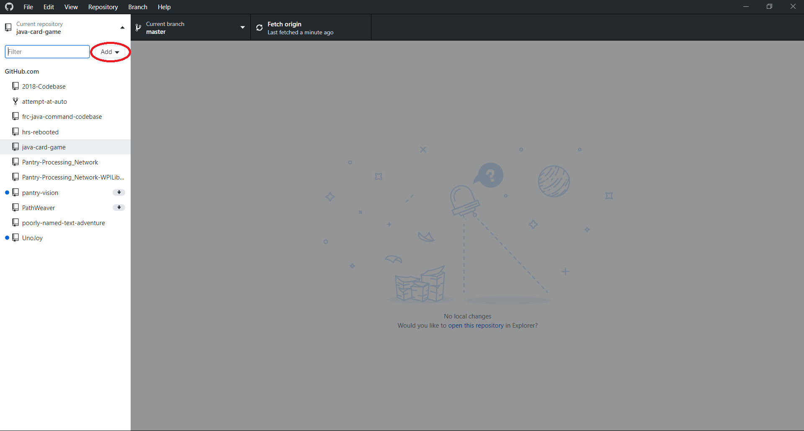]{style="overflow: hidden; display: inline-block; margin: 0.00px 0.00px; border: 0.00px solid #000000; transform: rotate(0.00rad) translateZ(0px); -webkit-transform: rotate(0.00rad) translateZ(0px); width: 624.00px; height: 334.67px;"}
4.  [Click the 'URL' tab at the top of the popup window]{.c3}
5.  In the first box, enter [BREAD5940/frc-java-command-codebase]{.c25}
6.  Click the 'Clone'
    button[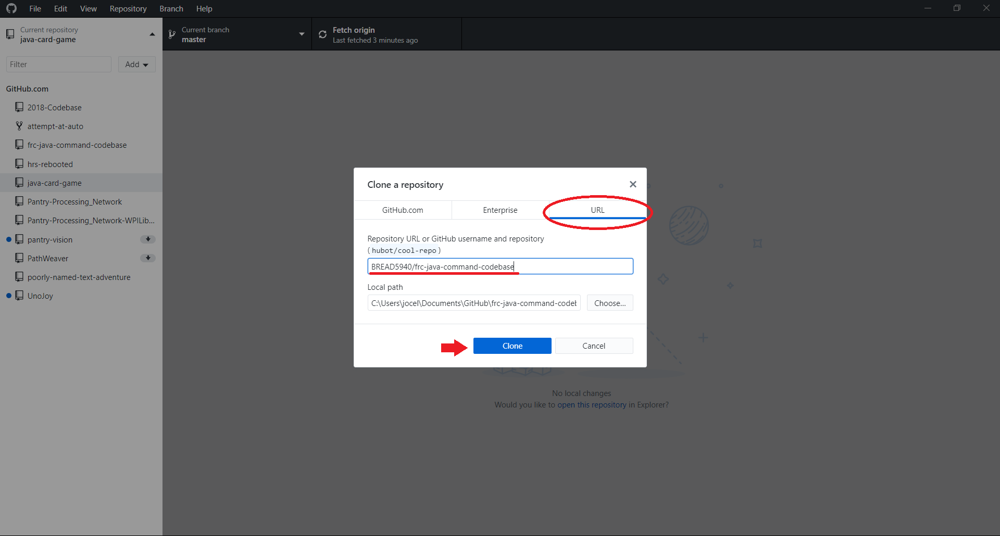]{style="overflow: hidden; display: inline-block; margin: 0.00px 0.00px; border: 0.00px solid #000000; transform: rotate(0.00rad) translateZ(0px); -webkit-transform: rotate(0.00rad) translateZ(0px); width: 624.00px; height: 334.67px;"}
7.  Once the repository clones, you should see
    'frc-java-command-codebase' under 'Current
    Repository'[]{style="overflow: hidden; display: inline-block; margin: 0.00px 0.00px; border: 0.00px solid #000000; transform: rotate(0.00rad) translateZ(0px); -webkit-transform: rotate(0.00rad) translateZ(0px); width: 624.00px; height: 334.67px;"}

[To select a branch other than the default branch, use the branches
dropdown in the center of the main menu.]{.c3}

[]{.c3}

### From Git Command Line {#h.85p71eflro6f .c7}

1.  [Open Git bash]{.c3}
2.  [Navigate to the directory you want to clone the repository into
    (ex. C:\\users\\your-username\\documents\\github\\)]{.c3}
3.  [Type the following line:]{.c3}

[]{#t.9bfb9e9b7c04e2aba50527854aefc89d4753b146}[]{#t.1}

+-----------------------------------------------------------------------+
| [git                                                                  |
| ]{.c29}[clone]{.c46}[ https://github.com/BREAD5940/frc-java-command-c |
| odebase]{.c29}                                                        |
+-----------------------------------------------------------------------+

[]{.c3}

4.  [Press 'Enter']{.c3}

[]{.c3}

To select a branch [other]{.c10}[ than the default branch, use]{.c3}

[]{#t.fd51da63f7bfb80ead01ca21863fb1346f827dac}[]{#t.2}

+-----------------------------------------------------------------------+
| [git checkout other-branch-name]{.c29}                                |
+-----------------------------------------------------------------------+

[]{.c37 .c18} {#h.bkwjiv9kwywx .c7 .c20}
-------------

[Open the Codebase in VSCode]{.c37 .c18} {#h.jjjkxt5jgz8p .c7}
----------------------------------------

### [Windows]{.c16 .c10} {#h.ixvbx9e570aq .c7}

1.  [Open VSCode]{.c3}
2.  From the 'File' dropdown select 'Open Folder' (Ctrl+K
    Ctrl-O)[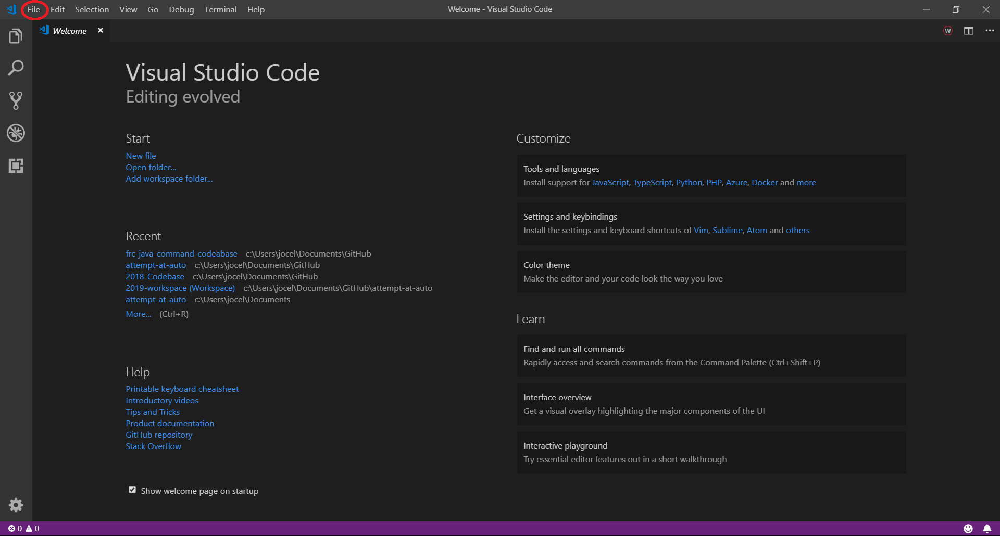]{style="overflow: hidden; display: inline-block; margin: 0.00px 0.00px; border: 0.00px solid #000000; transform: rotate(0.00rad) translateZ(0px); -webkit-transform: rotate(0.00rad) translateZ(0px); width: 624.00px; height: 334.67px;"}
3.  Navigate to and select the 'frc-java-command-codebase' folder
    (should be at
    C:\\users\\your-username\\documents\\github\\frc-java-command-codebase)[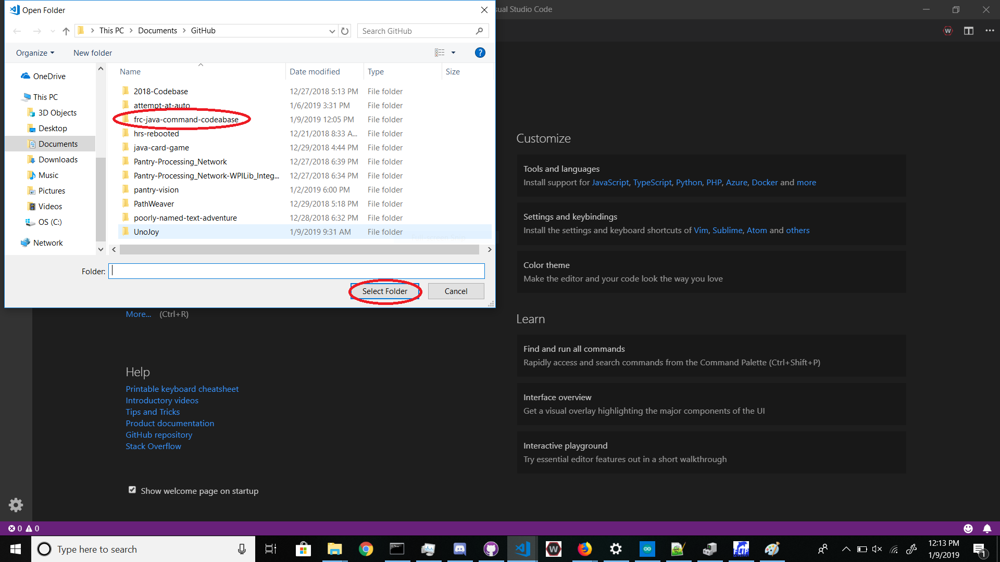]{style="overflow: hidden; display: inline-block; margin: 0.00px 0.00px; border: 0.00px solid #000000; transform: rotate(0.00rad) translateZ(0px); -webkit-transform: rotate(0.00rad) translateZ(0px); width: 624.00px; height: 350.67px;"}
4.  The codebase will open in the current VSCode
    window[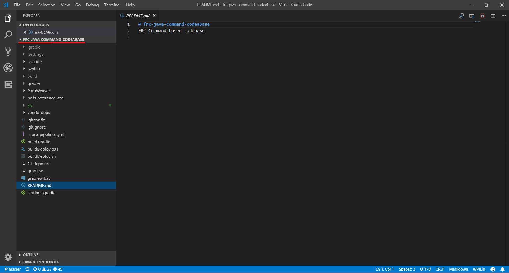]{style="overflow: hidden; display: inline-block; margin: 0.00px 0.00px; border: 0.00px solid #000000; transform: rotate(0.00rad) translateZ(0px); -webkit-transform: rotate(0.00rad) translateZ(0px); width: 624.00px; height: 334.67px;"}

### Mac^[\[d\]](#cmnt4){#cmnt_ref4}^ {#h.5byy2jutllpi .c7}

1.  [Open VSCode]{.c3}
2.  From the 'File' dropdown, select 'Add Folder to Workspace[']{.c3}
3.  [Navigate to and select the 'frc-java-command-codebase' folder]{.c3}
4.  [The codebase will open in the current VSCode window]{.c3}

------------------------------------------------------------------------

[]{.c1} {#h.d5m5gbkggyid .c7 .c35}
=======

[Java: The Basics]{.c1} {#h.3x092ok4scn0 .c7}
=======================

This section is a ridiculously simplified primer on Java for people who
have never programmed in Java and/or with objects before. However, it
does assume you have some form of programming experience (ex. Python,
Arduino, etc.). If you [have ]{.c10}programmed with objects in Java in
the past and feel confident in your abilities, skip ahead to [[Robot
Code: An Overview](#h.7ewejym85jrg){.c23}]{.c12}. For those of you still
here: this section will [in no way]{.c10} magically turn you into a
competent Java developer. It gives you [just]{.c10} enough information
to not be 100% lost in the next section. If you want to be able to truly
understand Java, please refer to some external resource (ex. [[Home and
Learn](https://www.google.com/url?q=https://www.homeandlearn.co.uk/java/java.html&sa=D&ust=1547844679851000){.c23}]{.c12} (start
at section 2 or
3), [[Codecademy](https://www.google.com/url?q=https://www.codecademy.com/learn/learn-java&sa=D&ust=1547844679851000){.c23}]{.c12},
[[Oracle](https://www.google.com/url?q=https://docs.oracle.com/javase/tutorial/index.html&sa=D&ust=1547844679852000){.c23}]{.c12},
or a formal Java class).

[]{.c3}

[Functions and Methods]{.c37 .c18} {#h.vo45lcwc6a4g .c7}
----------------------------------

### [Function vs. Method]{.c16 .c10} {#h.6q5rc2us9mo2 .c7}

[        Functions and methods are very similar. In short, methods are
just functions that happen to be inside classes. Both share the same
properties.]{.c3}

[]{.c3}

### Creating a Function {#h.23i39brr0wet .c7}

[]{#t.db211ead0c397e0bf67bd890afaf3a8ad12c92d0}[]{#t.3}

+-----------------------------------------------------------------------+
| [public]{.c14}[ ]{.c9}[void]{.c14}[ ]{.c9}[printString]{.c24          |
| .c18}[(String str){\                                                  |
|         System.out.println(str);\                                     |
| }]{.c9}                                                               |
+-----------------------------------------------------------------------+

### [Return Types]{.c16 .c10} {#h.t41z0xtxfw3t .c7}

        All functions (with the exception of constructors)
[must]{.c10} list a return type. A return type can be any class that has
been included in the file (including variable types). If the function
doesn't return anything, its return type is [void]{.c14} (as in our
example above). Other common return types are [String]{.c9},
[boolean]{.c14}, and [int]{.c14}[. ]{.c3}

### []{.c16 .c10} {#h.io828akst4hk .c7 .c22}

### Arguments {#h.bk3szcq88cwv .c7}

        Arguments are variables that are set each time the function is
called. You set an argument in the parentheses following the name of the
function. In our example above, the argument is a [String]{.c9} called
[str]{.c9}. Arguments can [only]{.c10}[ be used within the function, as
they are local variables defined within it.]{.c3}

[]{.c3}

### Public vs. Protected vs. Private {#h.mu64m0i1wryi .c7}

        Functions \-- like variables \-- can be defined as
[public]{.c14}, [private]{.c14}, or [protected]{.c14}. The differences
are simple: a [public]{.c14} function can be accessed from any class, a
[private]{.c14} function can only be accessed from within the class it's
defined in, and a [protected]{.c14} function can only be accessed from
the package it is defined in or child classes outside the package.

[]{.c3}

Objects and Classes {#h.ttmujtaz8ldr .c7}
-------------------

### An Analogy {#h.9ltpmm3816m .c7}

Objects are called objects because they are just that, objects. You can
think of an object as a template for a defined class of entity. For
example, if you made a box object, just like in real life you would need
to define the aspects of the box. This could include all things from the
material, dimensions, etc. Though, generally, the defined parts of the
object would only be things necessary for the code. Let's presume this
same box object except I don't instantiate it. If you do not instantiate
an object, you will know it is a specific object, but it will not have
anything defined. As such, the code would produce an error when trying
to find the dimensions or material of your box object because none
exist\-\-- you need to define them.

[]{.c3}

### [Defining a Class]{.c16 .c10} {#h.bk45aai8z8m0 .c7}

        A class is [always]{.c10}[ defined in its own .java file. The
syntax for defining a class is:]{.c3}

[]{#t.794fad4afe127a0888fe371e4d3820034534e31c}[]{#t.4}

+-----------------------------------------------------------------------+
| [public]{.c14}[ ]{.c9}[class]{.c14}[ ]{.c9}[MyClass]{.c26 .c18}[{\    |
|         ]{.c9}[public]{.c14}[ ]{.c9}[MyClass]{.c24 .c18}[(){\         |
| \                                                                     |
|         }\                                                            |
| }]{.c9}                                                               |
+-----------------------------------------------------------------------+

The first line defines the class itself. The name of the class
([MyClass]{.c9}) must [always]{.c10} be the same as the name of the
.java file it's in. The second line is the constructor for the class.
It's different from a normal method as it [always ]{.c10}[has the same
name as its class and it does not list a return type. You use this
constructor when you instantiate the object. You can even have multiple
constructors for the same object! For example:]{.c3}

[]{#t.4f8ff2b33a94272e7c900c5819cd913103a82197}[]{#t.5}

+-----------------------------------------------------------------------+
| [public]{.c14}[ ]{.c9}[class]{.c14}[ ]{.c9}[Foo]{.c26 .c18}[{\        |
|    String bar = ]{.c9}[\"foobar\"]{.c21}[;    \                       |
| \                                                                     |
|    ]{.c9}[public]{.c14}[ ]{.c9}[Foo]{.c24 .c18}[(String bar) {\       |
|       ]{.c9}[this]{.c14}[.bar = bar;    \                             |
|    }        \                                                         |
|    ]{.c9}[public]{.c14}[ ]{.c9}[Foo]{.c24 .c18}[() {\                 |
|        ]{.c9}[this]{.c14}[(]{.c9}[\"foo\"]{.c21}[);\                  |
|    }\                                                                 |
|    ]{.c9}[public]{.c14}[ ]{.c9}[Foo]{.c24                             |
| .c18}[(]{.c9}[double]{.c14}[ barWeight) {\                            |
|        String bar = barWeight.toString();\                            |
|        ]{.c9}[this]{.c14}[(bar);\                                     |
|    }\                                                                 |
| }]{.c9}                                                               |
+-----------------------------------------------------------------------+

In this class [Foo]{.c9}, there are actually 3 different constructors.
The one at the top takes a [String]{.c9} as a input and assigns the
class variable bar to the parameter. The second constructor takes no
arguments (i.e. you'd call it as [Foo foo =
]{.c9}[new]{.c14}[ Foo();]{.c9}) and calls the first constructor with
the argument as [\"foo\"]{.c21} using
the[ ]{.c9}[this]{.c14}[()]{.c9} keyword. The last constructor takes a
[double]{.c14} as an argument, converts it to a [String]{.c9}, and calls
the fist constructor with that string. This can be useful for objects
which should have a default value - for example, a robot pose should
default to [(]{.c9}[0]{.c47}[,]{.c9}[0]{.c47}[,]{.c9}[0]{.c47}[)]{.c9},
so the no-argument constructor could call
[this]{.c14}[(]{.c9}[0]{.c47}[,]{.c9}[0]{.c47}[,]{.c9}[0]{.c47}[);]{.c9} by
default^[\[e\]](#cmnt5){#cmnt_ref5}^[.]{.c3}

[]{.c3}

### The [this]{.c14}[ Keyword]{.c16 .c10} {#h.z9l7h4h8leqi .c7}

[        The this keyword is used within a class the same way the name
of an instance of that class is used in other classes. For example, if
you call this.foo in the Foo class, it's the same as calling Foo.foo in
a different class. This is used to differentiate between variables that
belong to the class as a whole and variables that belong to a specfic
method withing that class. For example:]{.c3}

p[ublic class MyClass{]{.c3}

        i[nt aNumber;]{.c3}

[        Public MyClass(int aNumber){]{.c3}

[                this.aNumber = aNumber;]{.c3}

        }

[]{.c3}

### Creat[ing an Instance of a Class]{.c16 .c10} {#h.8dhcvog7gnqb .c7}

[There are three steps to create an instance of a class in a different
file (known as an object).]{.c3}

1.  Make sure the class is imported with a line like
    [import]{.c14}[ src.main.java.MyClass; ]{.c9}[near the top of your
    file]{.c3}
2.  Create an instance of the class. You do this the same way you would
    define a variable, with a line like [MyClass newClass;]{.c9}
3.  Instantiate the object using the class's constructor with a line
    like [newClass = ]{.c9}[new]{.c14}[ MyClass();]{.c9} This tells the
    program that the object [newClass]{.c9} now 'holds' the result of
    the [MyClass()]{.c9} constructor and can call all the methods of
    [MyClass]{.c9}[ as an extension of itself]{.c3}

[]{.c3}

### Using Methods Inherited from a Class[ ]{.c16 .c10} {#h.nfm8wpwlyqjc .c7}

[        Once you have instantiated an object, you can use it to call
public methods from the class. Right now our class doesn't have any
methods, so let's add one.]{.c3}

[]{#t.f023f2846ab2d3c9f7ffebf945be220b4f7853a0}[]{#t.6}

+-----------------------------------------------------------------------+
| [public]{.c14}[ ]{.c9}[class]{.c14}[ ]{.c9}[MyClass]{.c26 .c18}[{\    |
|         ]{.c9}[public]{.c14}[ ]{.c9}[MyClass]{.c24 .c18}[(){\         |
|         }\                                                            |
|         \                                                             |
|         ]{.c9}[public]{.c14}[ ]{.c9}[static]{.c14}[ ]{.c9}[void]{.c14 |
| }[ ]{.c9}[printHello]{.c24                                            |
| .c18}[(){\                                                            |
|                 System.out.println(]{.c9}[\"Hello\"]{.c21}[);\        |
|         }\                                                            |
| }]{.c9}                                                               |
+-----------------------------------------------------------------------+

The [printHello()]{.c9} method is public, so it can be called from
outside the class, and should output [Hello]{.c9}[ to the system console
when called. But first, we have to call it.]{.c3}

        We can do this from our second file, where we created the object
[newClass]{.c9}[. In the main method, we add the line]{.c3}

[]{#t.58d2c1952d7a8eb88924a0aeac59309a3e04ae3c}[]{#t.7}

+-----------------------------------------------------------------------+
| [newClass.printHello();]{.c9}                                         |
+-----------------------------------------------------------------------+

[When we run the project, the console should output the following:]{.c3}

[]{#t.ddd4a8f67a91f5c410d0c3a481716bee339b6f80}[]{#t.8}

+-----------------------------------------------------------------------+
| [Hello]{.c9}                                                          |
+-----------------------------------------------------------------------+

[]{.c37 .c18} {#h.p002rvnd2c83 .c7 .c20}
-------------

Common Error Messag[es]{.c37 .c18} {#h.r5ji7aoazkw3 .c7}
----------------------------------

### [Null Pointer Exception]{.c16 .c10} {#h.vjg7i6cd3k5i .c7}

[        This error likely means you forgot to define or instantiate one
of your variables/objects. A recommended solution is to go to the line
listed in the error, click on and 'Peek definition' (Alt-F12) each
variable/object, and confirm each item on the following list is
true.]{.c3}

1.  [The variable/object is defined]{.c3}

<!-- -->

1.  Ex. [int]{.c14}[ num;]{.c9}

<!-- -->

2.  [The variable/object is instantiated]{.c3}

<!-- -->

1.  Ex. [num = ]{.c9}[3]{.c47}[;]{.c9}

<!-- -->

3.  [The location of the previous two requirements is accessible to the
    erroring line(s)]{.c3}

<!-- -->

1.  [If a variable/object is called in a method that is not the same as
    or a submethod of the method or class the variable/object is defined
    in, it will throw a null pointer exception. For example, this code
    would throw a null pointer exception:]{.c3}

[]{#t.864598f1caa7cdc285e6a9ba0ed74052f01faea7}[]{#t.9}

+-----------------------------------------------------------------------+
| [public]{.c14}[ ]{.c9}[class]{.c14}[ ]{.c9}[MyClass]{.c26 .c18}[{\    |
|         ]{.c9}[public]{.c14}[ ]{.c9}[void]{.c14}[ ]{.c9}[aMethod]{.c2 |
| 4                                                                     |
| .c18}[(){\                                                            |
|                 ]{.c9}[int]{.c14}[ anInt = ]{.c9}[1]{.c47}[;\         |
|         }\                                                            |
| \                                                                     |
|         ]{.c9}[public]{.c14}[ ]{.c9}[void]{.c14}[ ]{.c9}[anotherMetho |
| d]{.c24                                                               |
| .c18}[(){\                                                            |
|                 System.out.println(anInt);\                           |
|         }\                                                            |
| }]{.c9}                                                               |
+-----------------------------------------------------------------------+

[]{.c3}

[        But this code would not:]{.c3}

[]{#t.101d554604cb04306160d1bec834cfdfd39b13f8}[]{#t.10}

+-----------------------------------------------------------------------+
| [public]{.c14}[ ]{.c9}[class]{.c14}[ ]{.c9}[MyClass]{.c26 .c18}[{\    |
|     ]{.c9}[int]{.c14}[ anInt = ]{.c9}[2]{.c47}[;\                     |
|         ]{.c9}[public]{.c14}[ ]{.c9}[void]{.c14}[ ]{.c9}[aMethod]{.c2 |
| 4                                                                     |
| .c18}[(){\                                                            |
|                 anInt = ]{.c9}[1]{.c47}[;\                            |
|         }\                                                            |
| \                                                                     |
|         ]{.c9}[public]{.c14}[ ]{.c9}[void]{.c14}[ ]{.c9}[anotherMetho |
| d]{.c24                                                               |
| .c18}[(){\                                                            |
|                 System.out.println(anInt);\                           |
|           ]{.c9}[// this will print 1 if aMethod() is called first    |
| and 2 if it isn\'t]{.c38 .c10}[\                                      |
|         }\                                                            |
| }]{.c9}                                                               |
+-----------------------------------------------------------------------+

[]{.c3}

        This is because the variable [anInt]{.c9} in the second example
is defined in [MyClass]{.c9}[, making it accessible to both of its
methods. For this reason, you should always define your variables and
objects at the top of the class.]{.c3}

[]{.c3}

### [Invalid Syntax]{.c16 .c10} {#h.ducqzztriw14 .c7}

[        This is sort of a catch-all for syntax-related errors. The
following is a list of common syntax errors. ]{.c3}

1.  [Extra/missing curly brace]{.c3}
2.  [Extra/missing parenthesis]{.c3}
3.  [Variable name typo]{.c3}

<!-- -->

1.  [Remember variable names are case-sensitive]{.c3}

### [Constructor Undefined]{.c16 .c10} {#h.ctio58gu1fn8 .c7}

[        This error probably means you have a type mismatch when trying
to construct a new instance of a class. It might look something like
this:]{.c3}

[]{#t.616ed658fd94dffe1f8ca32ce053ba7bcbf92b0c}[]{#t.11}

+-----------------------------------------------------------------------+
| [⮿]{.c48 .c68}[\[Java\] The constructor                               |
| Path.Segment(Path.Waypoint\[\], Path.Waypoint) is undefined]{.c29}    |
+-----------------------------------------------------------------------+

        In this specific case, the constructor for
[Path.Segment]{.c9} is expecting two [Path.Waypoint]{.c9}s, but it got a
[Waypoint]{.c9} array and a [Waypoint]{.c9}[.]{.c3}

[        To fix this error, make sure the types in your constructor
definition and the types you're actually putting in the constructor on
the erroring line match. To quickly check the definition of a method in
VSCode, use 'Peek Definition' (Alt+F12).]{.c3}

[]{.c3}

------------------------------------------------------------------------

[]{.c1} {#h.tuiwbnhkaih5 .c7 .c35}
=======

[Robot Code: An Overview]{.c1} {#h.49912dujrvc8 .c7}
==============================

[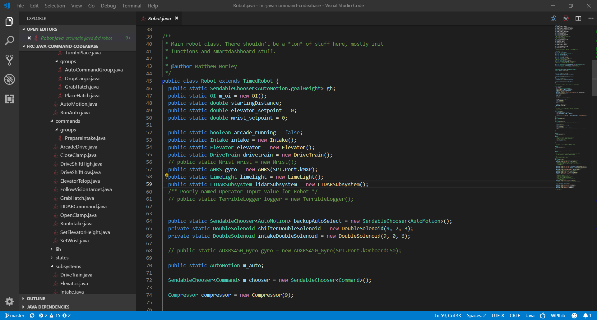]{style="overflow: hidden; display: inline-block; margin: 0.00px 0.00px; border: 0.00px solid #000000; transform: rotate(0.00rad) translateZ(0px); -webkit-transform: rotate(0.00rad) translateZ(0px); width: 624.00px; height: 334.67px;"}

[  The main Robot.java file of the codebase]{.c44 .c55 .c48}

[]{.c44 .c55 .c48}

[This section will walk through how our team's command-based codebase
works in the simplest of terms. At the end of the section, you should
have a good understanding of how each major part of the robot code works
and how to create a new command or subsystem. Each of the existing
subsystems and commands will be covered in-depth in the next
section]{.c3}

[]{.c3}

An Analogy {#h.cbwj92kz6lw3 .c7}
----------

[        Imagine you're at a sandwich shop. You order a grilled cheese
sandwich. The chef takes the bread from the oven and the cheese from the
fridge, then uses a panini press to grill your sandwich. Pretty common,
right? Believe it or not, this is pretty similar to how our team's
command-based robot codebase works. In this example, the fridge and the
oven would be subsystems of the sandwich shop, and the panini press
would act as a command to make the sandwich.]{.c3}

[]{.c3}

[Subsystems]{.c37 .c18} {#h.89rbi9vftcml .c7}
-----------------------

[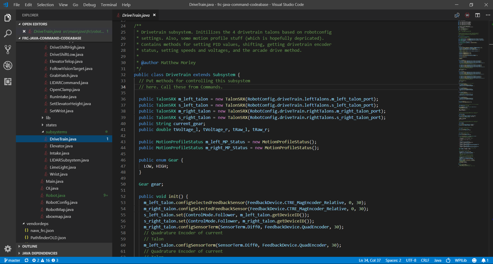]{style="overflow: hidden; display: inline-block; margin: 0.00px 0.00px; border: 0.00px solid #000000; transform: rotate(0.00rad) translateZ(0px); -webkit-transform: rotate(0.00rad) translateZ(0px); width: 624.00px; height: 334.67px;"} {#h.kfxdie56ll8o .c43}
-------------------------------------------------------------------------------------------------------------------------------------------------------------------------------------------------------------------------------------------------------------------

[  The drivetrain subsystem]{.c44 .c48 .c55}

[]{.c3}

[        Subsystems are the level of code closest to the actual
mechanics of the robot. It's fairly self-explanatory: each .java file in
the 'Subsystems' folder controls a specific "subsystem" on the robot \--
like the drivetrain, the intake, or the elevator. ]{.c3}

[        These files are where you do things like set the speeds of
motors or get vision processing data from a camera. But creating a
subsystem alone isn't enough to run the robot, you need commands to call
the subsystems from.]{.c3}

[]{.c3}

### How to Create a Subsystem^[\[f\]](#cmnt6){#cmnt_ref6}[\[g\]](#cmnt7){#cmnt_ref7}[\[h\]](#cmnt8){#cmnt_ref8}^ {#h.6fyeoglw22fc .c7}

        A subsystem is a class that extends the abstract class
[Subsystem]{.c9}[, which we import from the WPI library. The class
definition looks like this:]{.c3}

[]{#t.8352c2b68d3c40d84154db2b047f5226043d8e9f}[]{#t.12}

+-----------------------------------------------------------------------+
| [public]{.c14}[ ]{.c9}[class]{.c14}[ ]{.c9}[MySubsystem]{.c26         |
| .c18}[ ]{.c9}[extends]{.c14}[ ]{.c9}[Subsystem]{.c26 .c18}[{\         |
| }]{.c9}                                                               |
+-----------------------------------------------------------------------+

[In addition to this, we need an initialization function:]{.c3}

[]{#t.e96212dd4356b502f6991abbdadf78b51a481e48}[]{#t.13}

+-----------------------------------------------------------------------+
| [public]{.c14}[ ]{.c9}[class]{.c14}[ ]{.c9}[MySubsystem]{.c26         |
| .c18}[ ]{.c9}[extends]{.c14}[ ]{.c9}[Subsystem]{.c18 .c26}[{\         |
|         ]{.c9}[public]{.c14}[ ]{.c9}[void]{.c14}[ ]{.c9}[init]{.c24   |
| .c18}[(){\                                                            |
|                 ]{.c9}[// put stuff you want the subsystem to         |
| do]{.c38 .c10}[\                                                      |
|          ]{.c9}[//  when initializing here]{.c38 .c10}[\              |
|         }\                                                            |
| }]{.c9}                                                               |
+-----------------------------------------------------------------------+

[From here, you can add any functions you want to be a part of your
subsystem. For more examples, look at the subsystems in the
codebase.]{.c3}

[]{.c3}

[Commands]{.c37 .c18} {#h.pq8fh8lvuihl .c43}
---------------------

[        ]{.c37 .c18} {#h.sn51szao28os .c43}
---------------------

[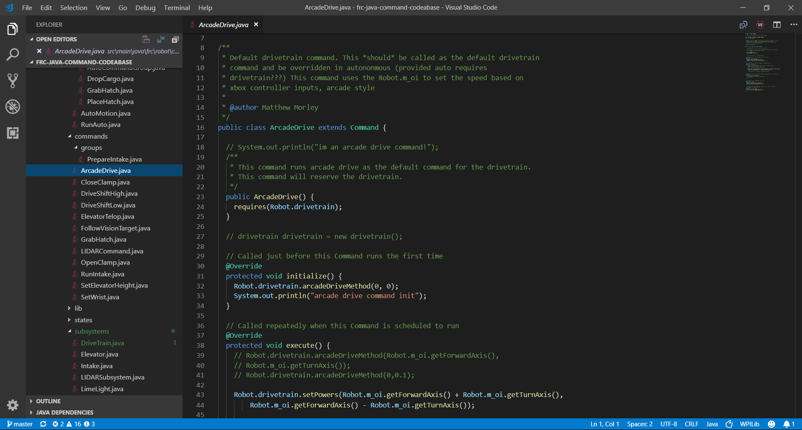]{style="overflow: hidden; display: inline-block; margin: 0.00px 0.00px; border: 0.00px solid #000000; transform: rotate(0.00rad) translateZ(0px); -webkit-transform: rotate(0.00rad) translateZ(0px); width: 624.00px; height: 334.67px;"}

  The arcade drive command

[]{.c3}

[        Commands are what allow the input from the human operators to
actually control the robot. They 'require' different subsystems (such as
the drivetrain) and tell them to do specific things (like drive).]{.c3}

[]{.c3}

### [How to Create a Command]{.c16 .c10} {#h.lcqpbdfyhdtt .c7}

        A command is a class that extends the abstract class
[Command]{.c9}[, which we also import from the WPI library. The class
definition looks like this:]{.c3}

[]{#t.edc316a2c295047804311c7fc9b78f1029324f1a}[]{#t.14}

+-----------------------------------------------------------------------+
| [public]{.c14}[ ]{.c9}[class]{.c14}[ ]{.c9}[MyCommand]{.c26           |
| .c18}[ ]{.c9}[extends]{.c14}[ ]{.c9}[Command]{.c26 .c18}[{\           |
| }]{.c9}                                                               |
+-----------------------------------------------------------------------+

[In addition to this, the Command class has six methods that need to be
created in order for it to function. ]{.c3}

[]{.c3}

[Note: the ]{.c56}[\@override]{.c18 .c51}[ before most of the methods
shows it overrides other code already built into the Command superclass.
You should ]{.c56}[always]{.c10 .c56}[ override these methods. (In fact,
it'll give you a bunch of errors if you don't).]{.c3 .c56}

[]{.c3 .c56}

[]{#t.4d9f97936f303795da8f8d951117b80f5d3e4d01}[]{#t.15}

+-----------------------------------------------------------------------+
| [public]{.c14}[ ]{.c9}[MyCommand]{.c18 .c24}[(){\                     |
|         ]{.c9}[requires]{.c14}[(MySubsystem);\                        |
| }]{.c9}                                                               |
+-----------------------------------------------------------------------+

[1. The constructor]{.c3}

        The constructor of a Command functions exactly like a normal
constructor with the exception that you can include
[requires]{.c14}[()]{.c9}[ statements to declare which subsystems the
command will use.]{.c3}

[]{.c3}

[]{#t.61e95319279cb6a379903698d14cd8ced660c951}[]{#t.16}

+-----------------------------------------------------------------------+
| [\@override]{.c31 .c18}[\                                             |
| ]{.c9}[protected]{.c14}[ ]{.c9}[void]{.c14}[ ]{.c9}[initialize]{.c24  |
| .c18}[(){\                                                            |
|         ]{.c9}[// put initialization code here]{.c38 .c10}[\          |
| }]{.c9}                                                               |
+-----------------------------------------------------------------------+

[2. Initialization]{.c3}

        This method contains the code that runs right before the command
executes for the first time. So when you call a command, this code runs
only once, at the beginning, followed by [execute()]{.c9}[. This is a
good place to put things like motor and subsystem initializations.
]{.c3}

[]{.c3}

[]{#t.fcd45be4d9cb9b19482774a90525cee847727e23}[]{#t.17}

+-----------------------------------------------------------------------+
| [\@override]{.c18 .c31}[\                                             |
| ]{.c9}[protected]{.c14}[ ]{.c9}[void]{.c14}[ ]{.c9}[execute]{.c24     |
| .c18}[(){\                                                            |
|         ]{.c9}[// put code to execute here]{.c38 .c10}[\              |
| }]{.c9}                                                               |
+-----------------------------------------------------------------------+

[3. Execution]{.c3}

        This method contains the code that will run in a loop until
[isFinished()]{.c9} returns [true]{.c14}[. This is a good place to put
things like PID loops and joystick controls.]{.c3}

[]{.c3}

[]{#t.169efbec27e0ff12eae06f112c36a0966f029ef6}[]{#t.18}

+-----------------------------------------------------------------------+
| [\@override]{.c31 .c18}[\                                             |
| ]{.c9}[protected]{.c14}[ ]{.c9}[boolean]{.c14}[ ]{.c9}[isFinished]{.c |
| 24                                                                    |
| .c18}[(){\                                                            |
|         ]{.c9}[// put code to check for completion here]{.c38 .c10}[\ |
| }]{.c9}                                                               |
+-----------------------------------------------------------------------+

[4. Check for completion]{.c3}

        This is the method that determines if the command has completed
or not. If you want this command to happen with only one loop of
[execute()]{.c9}, then simply put
[return]{.c14}[ ]{.c9}[true]{.c14}[;]{.c9} in this method. Otherwise,
you'll probably have some sort of statement that returns
[true]{.c14}[ under certain conditions.]{.c3}

[]{.c3}

[]{#t.47ff9fb24dd7811a04c3a6e30d03c4735183b9c4}[]{#t.19}

+-----------------------------------------------------------------------+
| [\@override]{.c31 .c18}[\                                             |
| ]{.c9}[protected]{.c14}[ ]{.c9}[void]{.c14}[ ]{.c9}[end]{.c24         |
| .c18}[(){\                                                            |
|         ]{.c9}[// put code to end the command here]{.c38 .c10}[\      |
| }]{.c9}                                                               |
+-----------------------------------------------------------------------+

[5. End]{.c3}

        This method contains the code that will run after
[isFinished()]{.c9} returns [true]{.c14}[. This is a good place to do
things like setting motors back to zero so the robot doesn't keep moving
on its own.]{.c3}

[]{.c3}

[]{#t.b7284edea61081f6c9fc2e60e0b9077c78110845}[]{#t.20}

+-----------------------------------------------------------------------+
| [\@override]{.c31 .c18}[\                                             |
| ]{.c9}[protected]{.c14}[ ]{.c9}[void]{.c14}[ ]{.c9}[interrupted]{.c24 |
| .c18}[(){\                                                            |
|         ]{.c9}[// put code to run if the command is interrupted       |
| here]{.c38 .c10}[\                                                    |
| }]{.c9}                                                               |
+-----------------------------------------------------------------------+

[6. If interrupted]{.c3}

        This method contains the code that will run if the command is
interrupted. A command can be interrupted if another command that is
scheduled to run requires the same subsystem(s) as the current command.
The code in here will probably be similar to the code in the
[end()]{.c9} method.

[]{.c3}

Command Groups {#h.1rnnndsgllkr .c7}
--------------

[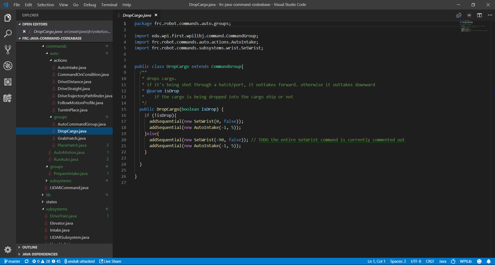]{style="overflow: hidden; display: inline-block; margin: 0.00px 0.00px; border: 0.00px solid #000000; transform: rotate(0.00rad) translateZ(0px); -webkit-transform: rotate(0.00rad) translateZ(0px); width: 624.00px; height: 334.67px;"}

[  The DropCargo command group]{.c44 .c55 .c48}

[]{.c3}

        Command groups are similar to commands in that they allow human
operators to control the robot and its subsystems. In fact, in many
situations they can be treated [exactly]{.c10}[ like regular commands.
]{.c3}

[]{.c3}

### [How to Create a Command Group]{.c16 .c10} {#h.shpsx2rxolrx .c7}

[        While commands and command groups are similar in many ways,
their construction is vastly different. Where commands need many methods
in order to function (initialize(), execute(), etc.), a command group
needs only one: the constructor.]{.c3}

[        This is an example of an empty command group:]{.c3}

[]{#t.08dc130679a152a7a7791495722ff4ce87487144}[]{#t.21}

+-----------------------------------------------------------------------+
| [p]{.c14}[ublic class]{.c14}[ MyCommandGroup extends SequentialCommandGroup {\  |
|         ]{.c9}[public]{.c14}[ ]{.c9}[MyCommandGroup]{.c24 .c18}[ ()   |
| {\                                                                    |
|                 ]{.c9}[// Put constructor code here]{.c10 .c38}[\     |
|         }\                                                            |
| }]{.c9}                                                               |
+-----------------------------------------------------------------------+

[]{.c3}

        Right now, this does nothing. You could call it and it wouldn't
throw any errors. But the robot wouldn't move. To make a command group
[functional]{.c10}, you need to add commands. You can do this
sequentially with [addSequential()]{.c9} or in parallel with
[addParallel()]{.c9}. Sequential commands run one after another, where
parallel commands run all at the same time. It's a [very bad
idea]{.c10}[ to try and run two commands that require the same subsystem
in parallel. One of the commands won't run.]{.c3}

[        This is an example of a command group with both sequential and
parallel commands:]{.c3}

[]{#t.b19020bbad42d62efc688d14163e2a8500371107}[]{#t.22}

+-----------------------------------------------------------------------+
| [public]{.c14}[ ]{.c9}[class]{.c14}[ ]{.c9}[MyCommandGroup]{.c26      |
| .c18}[ ]{.c9}[extends]{.c14}[ ]{.c9}[CommandGroup]{.c26 .c18}[ {\     |
|         ]{.c9}[public]{.c14}[ ]{.c9}[MyCommandGroup]{.c24 .c18}[ ()   |
| {\                                                                    |
|                 ]{.c9}[// runs first]{.c38 .c10}[\                    |
|                 addSequential(]{.c9}[new]{.c14}[ MyCommand());\       |
| \                                                                     |
|                 ]{.c9}[// run together]{.c38 .c10}[\                  |
|                 addParallel(]{.c9}[new]{.c14}[ MyOtherCommand());\    |
|                 addParallel(]{.c9}[new]{.c14}[ MyOtherOtherCommand()) |
| ;\                                                                    |
|         }\                                                            |
| }]{.c9}                                                               |
+-----------------------------------------------------------------------+

[]{.c3}

PID {#h.m5be45bx1jfu .c7}
---

A PID controller essentially sets some value that it wants the robot to
maintain or achieve, whether that be an angle, velocity, etc. and goes
through some equations to attempt to maintain or achieve that value. A
separate document on PID control and control systems in available
[[here.](https://www.google.com/url?q=https://docs.google.com/document/d/1csKfsUbsoCouG5HirCx3UHt7Tb5rvuiuEl2lKhG2J_s/edit%23&sa=D&ust=1547844679902000){.c23}]{.c12}

[]{.c3}

[ This works based on three variables, P, I, and D; hence the name PID.
]{.c3}

-   [P- proportional ]{.c3}
-   [I- integral ]{.c3}
-   [D- Derivative ]{.c3}

[This may sound like fancy calculus, but it can actually be quite
simple. In the most simplistic PID system, it is simply trying to
maintain a constant value, and whenever that value is threatened, the
system changes in the direction that favours keeping the constant value.
For example, if we wanted to keep a house at exactly 23 degrees, the
controller would kick on either heating or cooling until sensors
indicated that the home was back to 23 degrees. ]{.c3}

[]{.c3}

[Here is a simple PID diagram utilizing all three variables: ]{.c3}

[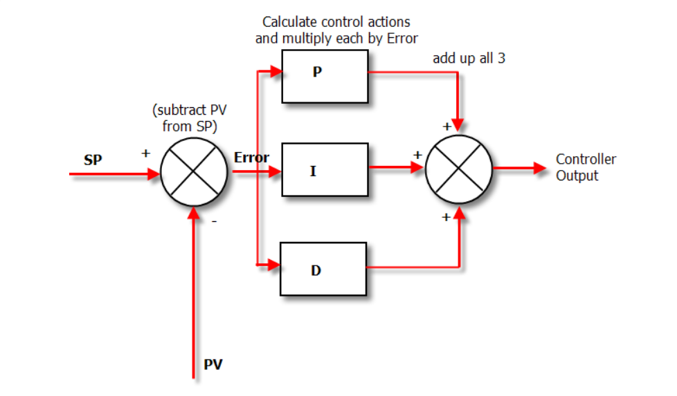]{style="overflow: hidden; display: inline-block; margin: 0.00px 0.00px; border: 0.00px solid #000000; transform: rotate(0.00rad) translateZ(0px); -webkit-transform: rotate(0.00rad) translateZ(0px); width: 624.00px; height: 365.33px;"}

[SP - set point(value that the robot wants)]{.c3}

[PV-  process variable (value the robot is)]{.c3}

If you need more help understanding PID, here is a helpful
[[link](https://www.google.com/url?q=https://www.csimn.com/CSI_pages/PIDforDummies.html&sa=D&ust=1547844679904000){.c23}]{.c12}[.]{.c3}

In the meantime,
[[here](https://www.google.com/url?q=https://github.com/tekdemo/MiniPID-Java/blob/master/src/com/stormbots/MiniPID.java&sa=D&ust=1547844679905000){.c23}]{.c12}[ is
a simple PID example in java. ]{.c3}

[ ]{.c3}

Shuffleboard^[\[i\]](#cmnt9){#cmnt_ref9}^ {#h.rxm7656k4ny4 .c7}
-----------------------------------------

[]{.c3}

[Auto]{.c37 .c18} {#h.408xql4ohk1y .c7}
-----------------

[        The 'Auto' section of the codebase is what's used when we want
the robot to complete certain tasks without human input. This can be
used for the Autonomous period of the match where (most years) the robot
cannot be controlled through the driver station. It can also be used to
have the robot complete actions that could be difficult for a human
operator.]{.c3}

[]{.c3}

### [Auto Actions]{.c16 .c10} {#h.nx0a2fo0a8y5 .c7}

[        An auto action is basically identical to a regular command in
terms of construction. The main differences are:]{.c3}

1.  [An auto action should not be set as a default command for a
    subsystem]{.c3}
2.  [An auto action should not include any OI calls]{.c3}
3.  [An auto action should end]{.c3}

[]{.c3}

### [Auto Action Groups]{.c16 .c10} {#h.2ilz3d4f4zfq .c7}

[        Auto action groups are command groups for auto actions. They
are constructed in the same way as a regular command group. They tend to
be more practical than just using actions as they make it easy to
complete a long series of commands, especially if that series is to be
reused elsewhere.]{.c3}

[]{.c3}

### [AutoMotion]{.c16 .c10} {#h.n0xlq5ubo40g .c7}

        This class is what chooses the right set of commands based on
limited user input. On a high level, it just creates a command group to
meet specific guidelines (ex. height of the goal, the type of piece,
etc.).

------------------------------------------------------------------------

[]{.c3}

Robot Code: In Detail {#h.vjkrpzce0oy .c7}
=====================

        This section will cover a few of the most important classes in
the codebase, followed by a brief set of 'tutorials' on essential skills
for programming the robot. After this section, you should be able to
attempt or at least understand [all]{.c10} the projects in the [[Project
Index](#h.no025za6yj4b){.c23}]{.c12}. For a more in-depth look at
[everything]{.c10} on the robot, it is recommended that you read through
the documentation for the codebase, found
[[here](https://www.google.com/url?q=https://bread5940.github.io/frc-java-command-codebase/javadoc/&sa=D&ust=1547844679909000){.c23}]{.c12}[.]{.c3}

[]{.c3}

[Robot]{.c37 .c18} {#h.gb534roervmi .c7}
------------------

        The Robot class ([Robot.java]{.c9}[) is the main class for the
robot. This is where you should instantiate and define an instance of
each of your subsystems, to be used across the entire program. It also
contains several major methods that can be filled with the appropriate
code.]{.c3}

        The [\*Init()]{.c9} methods ([teleopInit()]{.c9},
[disabledInit()]{.c9}, etc.) should contain code you want to run
[once]{.c10} when the robot enters that mode. The exception is
[robotInit()]{.c9}[, which contains code you want to run once when the
robot starts up.]{.c3}

        The [\*Periodic()]{.c9} methods ([teleopPeriodic()]{.c9}, etc.)
should contain code you want to run [periodically]{.c10} when the robot
is in that mode. The exception is, again, [robotPeriodic()]{.c9}[, which
should contain code you want to run periodically while the robot is on,
regardless of mode.]{.c3}

[]{.c3}

[Operator Input (OI)]{.c37 .c18} {#h.ydl39dx5lgpq .c7}
--------------------------------

        The Operator Input class ([OI.java]{.c9}[) contains the majority
of the code for connecting the operator input through the xbox
controllers to actual commands in the codebase. It binds each button to
a specific command, and contains the methods for getting the axes of the
various joysticks on the controllers.]{.c3}

[]{.c3}

[RobotConfig]{.c37 .c18} {#h.yp1e8ncmejrl .c7}
------------------------

        The RobotConfig class (RobotConfig.java and all its many, many
subclasses) is effectively just used as a list of static variables for
things like the maximum speed of the robot and the effective diameter of
the wheels. These variables are then called across the codebase as a
replacement for directly inputting those values, making it
[far]{.c10} easier to change one of them if needed: you can just change
it in one place instead of trying to track down every time it's used
across the [entire]{.c10}[ codebase.]{.c3}

[]{.c3}

------------------------------------------------------------------------

[]{.c37 .c18} {#h.jbchggm7qttl .c7 .c20}
-------------

[Important Things to Understand]{.c37 .c18} {#h.dvwnmqwmmn19 .c7}
-------------------------------------------

### [Buttons and the OI Class]{.c16 .c10} {#h.jxzhyy74hbrf .c7}

The OI class is responsible for taking any inputs provided by a human
and turning them into words that the robot understands. One of the main
ways to interact with the robot is via the use of buttons which trigger
commands or command groups for the robot to follow. Buttons can be
anything, as long as [they can communicate with the driver station
laptop via USB. Teams have used anything from xbox controller to
joysticks to guitar hero guitars to bongo drums and a dance pad. No
really.
]{.c3}[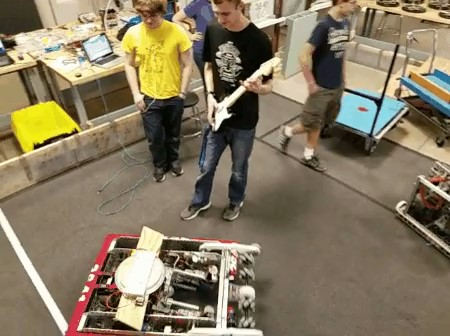]{style="overflow: hidden; display: inline-block; margin: 0.00px 0.00px; border: 0.00px solid #000000; transform: rotate(0.00rad) translateZ(0px); -webkit-transform: rotate(0.00rad) translateZ(0px); width: 450.00px; height: 336.00px;"}

[The workflow to bind a button to a command is pretty simple. Generally,
one would (1) instantiate a joystick, (2) instantiate a button on said
joystick, and (3) define a command inside of OI's constructor to run
when the button is (a) pressed, (b) released, or (c) while held down. Up
to 5 USB controllers can be instantiated on a driver station
computer.]{.c3}[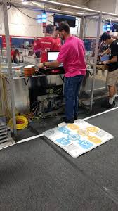]{style="overflow: hidden; display: inline-block; margin: 0.00px 0.00px; border: 0.00px solid #000000; transform: rotate(0.00rad) translateZ(0px); -webkit-transform: rotate(0.00rad) translateZ(0px); width: 168.00px; height: 300.00px;"}

[]{.c3}

In this example, we see that two controllers are instantiated on "ports"
one and two. Next, we define a bunch of buttons on the two controllers
bound to different button "ports."^[\[j\]](#cmnt10){#cmnt_ref10}^ In
this case, we have a [xboxmap]{.c9} class that stores these numbers in a
more human-readable form. Inside of the OI constructor, we assign these
button instances to an action. For example, on line 49 we assign a
[DriveShiftHigh()]{.c9} Command to the
[shift\_up\_button]{.c9} [Button]{.c9} instance. We could use
[whenReleased()]{.c9} or [whilePressed()]{.c9} if our action required
something different - for example, a command that tries to drive to the
goal [while]{.c10} the button was pressed. Keep in mind with
[whilePressed()]{.c9} that when the button is released, the
[interrupted()]{.c9} method will be called to forcibly cancel the
command.[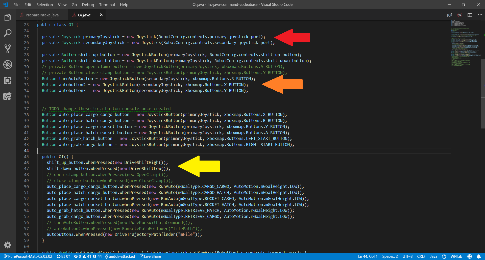]{style="overflow: hidden; display: inline-block; margin: 0.00px 0.00px; border: 0.00px solid #000000; transform: rotate(0.00rad) translateZ(0px); -webkit-transform: rotate(0.00rad) translateZ(0px); width: 763.99px; height: 410.50px;"}

### []{.c16 .c10} {#h.mdceb3vk0b2p .c7 .c22}

### []{.c16 .c10} {#h.k321ct1071tz .c7 .c22}

### []{.c16 .c10} {#h.kzw3s89pcmoj .c7 .c22}

### [Getting Joystick Values]{.c16 .c10} {#h.y4uta5hxycpn .c7}

[        Joystick values are useful in controlling pretty much every
part of the robot. They're different from buttons in that they have an
x- and y-axis, both of which return an analog value between -1 and 1.
]{.c3}

[]{.c3}

[To define and instantiate a joystick:]{.c3}

[]{#t.d7eec1f7390ea5eacc2ba8566b33979b9cb28b60}[]{#t.23}

+-----------------------------------------------------------------------+
| [Joystick myJoystick =                                                |
| ]{.c9}[new]{.c14}[ Joystick(myJoystickPort);]{.c9}                    |
+-----------------------------------------------------------------------+

The value of [myJoystickPort]{.c9}[ should be the port number of that
joystick. You can check what this is through the driver station.]{.c3}

[]{.c3}

[To get the value of a joystick axis:]{.c3}

[]{#t.16316522c053325780d3a91201070b2de2f52bf2}[]{#t.24}

+-----------------------------------------------------------------------+
| [double]{.c14}[ value = myJoystick.getRawAxis(anAxis);]{.c9}          |
+-----------------------------------------------------------------------+

The value of [anAxis]{.c9}[ should match the 'axis number' of the axis
you're trying to read. ]{.c3}

We use [getRawAxis()]{.c9} from the [GenericHID]{.c9} superclass as
opposed to one of the more specific axis methods from the
[Joystick]{.c9} superclass ([getXAxis()]{.c9}, [getYAxis()]{.c9}, etc.)
because our Xbox controllers have [two]{.c10} joysticks per controller,
but the driver station (that passes values to the code) sees them as
different axis on the [same]{.c10} instance of [Joystick]{.c9}. This
means what [Joystick]{.c9} considers to be the x- and y-axis may not
[actually]{.c10} be the x- and y-axis of the [actual]{.c10} joystick,
not to mention the fact that we could only use one of them. In essence,
it allows us to differentiate between the two joysticks on the
controller.

[]{.c3}

### []{.c16 .c10} {#h.aww05a51bghr .c7 .c22}

[]{.c3}

[]{.c3}

[]{.c37 .c18} {#h.dhjrt5do8q0d .c7 .c20}
-------------

------------------------------------------------------------------------

[]{.c3}

[Actually Writing Code]{.c1} {#h.vb254lidm854 .c7}
============================

[Git: An Abbreviated Introduction to Version Control]{.c37 .c18} {#h.k82o4atkmy8k .c7}
----------------------------------------------------------------

### [What is Git and GitHub?]{.c16 .c10} {#h.lxj4ea5f3on9 .c7}

Git is an FOSS^[\[k\]](#cmnt11){#cmnt_ref11}^[ program developed to help
programmers keep track of different versions of their work. Git works by
logging changes made to files over distinct changes (called 'Commits')
and building them sequentially after one another, very similarly to the
version history present in Google Docs, only better. GitHub is an online
service that provides Git repository hosting services for free, in
addition to other project management tools such as project boards,
website hosting and wikis. There are multiple Git providers, including
GitHub's competitor BitBucket. ]{.c3}

[]{.c3}

### [What is a Commit?]{.c16 .c10} {#h.ckdu957wvlp7 .c7}

[A commit is one distinct change, or group of changes, to the "working
tree." Inside of the commit is a list of all the things that changed
between the old working tree and now. For example, ]{.c3}

[]{#t.999e0bf9c0549f270cc4c0eda249c2d89f82eb99}[]{#t.25}

+-----------------------------------------------------------------------+
| [diff \--git a/src/main/java/frc/robot/OI.java                        |
| b/src/main/java/frc/robot/OI.java\                                    |
| index ]{.c29 .c33}[7]{.c46 .c33}[ac3e17..ce7a182 ]{.c29               |
| .c33}[100644]{.c46 .c33}[\                                            |
| \-\-- a/src/main/java/frc/robot/OI.java\                              |
| +++ b/src/main/java/frc/robot/OI.java\                                |
| @@ -]{.c29 .c33}[6]{.c46 .c33}[,]{.c29 .c33}[6]{.c46 .c33}[ +]{.c29   |
| .c33}[6]{.c46 .c33}[,]{.c29 .c33}[7]{.c46 .c33}[ @@ import            |
| edu.wpi.first.wpilibj.buttons.JoystickButton;\                        |
| import frc.robot.commands.auto.RunAuto;\                              |
| import frc.robot.commands.auto.AutoMotion.mGoalType;\                 |
| import frc.robot.commands.auto.actions.DriveTrajectoryPathfinder;\    |
| ]{.c29 .c33}[+import                                                  |
| frc.robot.commands.auto.actions.PurePursuit;]{.c58 .c33 .c48}[\       |
| import frc.robot.commands.auto.actions.TurnInPlace;\                  |
| import frc.robot.commands.subsystems.drivetrain.DriveShiftHigh;\      |
| import frc.robot.commands.subsystems.drivetrain.DriveShiftLow;\       |
| @@ -]{.c29 .c33}[58]{.c46 .c33}[,]{.c29 .c33}[8]{.c46 .c33}[ +]{.c29  |
| .c33}[59]{.c46 .c33}[,]{.c29 .c33}[9]{.c46 .c33}[ @@ public class OI  |
| {\                                                                    |
|     // turnAutoButton.whenPressed(new PurePursuitPathCommand());\     |
|     // autobutton2.whenPressed(new RamsetePathFollower(]{.c29         |
| .c33}[\"filePath\"]{.c33 .c48 .c57}[));\                              |
|     autobutton3.whenPressed(new DriveTrajectoryPathfinder(]{.c29      |
| .c33}[\"mFile\"]{.c57 .c33 .c48}[));\                                 |
| ]{.c29 .c33}[-    open\_clamp\_button.whenPressed(new OpenClamp());\  |
| -    close\_clamp\_button.whenPressed(new CloseClamp());]{.c33 .c48   |
| .c59}[\                                                               |
| ]{.c29 .c33}[+    // open\_clamp\_button.whenPressed(new              |
| OpenClamp());\                                                        |
| +    // close\_clamp\_button.whenPressed(new CloseClamp());\          |
| +    open\_clamp\_button.whenPressed(new PurePursuit());]{.c33 .c48   |
| .c58}[\                                                               |
|   }\                                                                  |
| \                                                                     |
|   public double getForwardAxis() { ]{.c29 .c33}[return]{.c33 .c48     |
| .c70}[ -]{.c29 .c33}[1]{.c33 .c46}[ \*                                |
| primaryJoystick.getRawAxis(RobotConfig.controls.forward\_axis); }\    |
| diff \--git                                                           |
| a/src/main/java/frc/robot/commands/auto/actions/PurePursuit.java      |
| b/src/main/java/frc/robot/commands/auto/actions/PurePursuit.java]{.c2 |
| 9                                                                     |
| .c33}                                                                 |
+-----------------------------------------------------------------------+

Online, [[commits look like
this](https://www.google.com/url?q=https://github.com/BREAD5940/frc-java-command-codebase/commit/65c1498239394bf82b1f1100a31dff9d24a90437&sa=D&ust=1547844679925000){.c23}]{.c12}.
[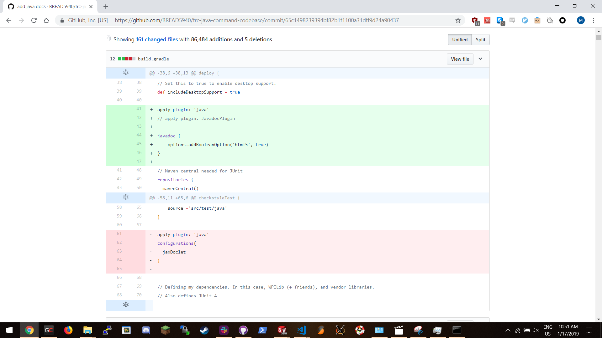]{style="overflow: hidden; display: inline-block; margin: 0.00px 0.00px; border: 0.00px solid #000000; transform: rotate(0.00rad) translateZ(0px); -webkit-transform: rotate(0.00rad) translateZ(0px); width: 417.00px; height: 296.00px;"}

Differences can be visualized without commiting via the Github Desktop
app, or the command line using [git diff]{.c25}[: ]{.c3}

[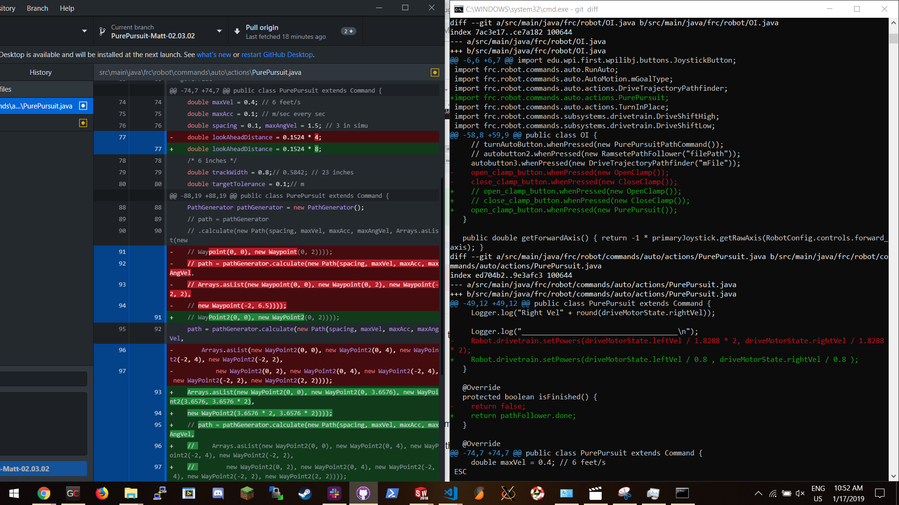]{style="overflow: hidden; display: inline-block; margin: 0.00px 0.00px; border: 0.00px solid #000000; transform: rotate(0.00rad) translateZ(0px); -webkit-transform: rotate(0.00rad) translateZ(0px); width: 624.00px; height: 339.00px;"}

[Commits are titled with a description of what changed and internally
named using an ID unique to each commit.]{.c3}

[]{.c3}

### [What are Branches?]{.c16 .c10} {#h.6qo2tlr0wy1u .c7}

[Branches are like different versions of the same document. In a branch,
you can diverge from the main line of development in the master branch
to work on some feature or other task without interfering with other
people's work. In many ways, when a new branch is created, it's like
making another copy of this Google Doc, working on it at home without
telling anyone else about it, then taking the changes you made and
pasting them back into the main document. All branches (should) stem
from a source called master, and can branch off each other at different
points in time/commits. Graphically, an example of a branch looks like
this:]{.c3}

[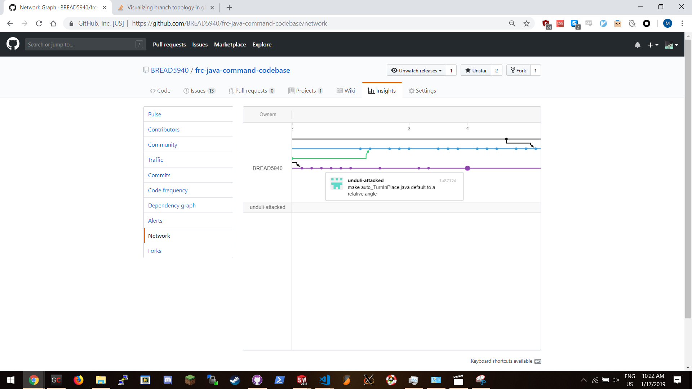]{style="overflow: hidden; display: inline-block; margin: 0.00px 0.00px; border: 0.00px solid #000000; transform: rotate(0.00rad) translateZ(0px); -webkit-transform: rotate(0.00rad) translateZ(0px); width: 458.00px; height: 165.00px;"}

There can be multiple "working copies" of the same project at any one
given time, each branched off from each other with some code from one
fork pulled into another fork. The whole thing can get really confusing
really quickly, which is why branch naming standards and git commit
standards are in place and available [[on the
wiki](https://www.google.com/url?q=https://github.com/BREAD5940/frc-java-command-codebase/wiki/Branch-naming-conventions&sa=D&ust=1547844679927000){.c23}]{.c12}[.
]{.c3}

[]{.c37 .c18} {#h.1mx7d1ejzwq1 .c7 .c20}
-------------

### Command Line Git (For Advanced Users) {#h.984m5lnqbof .c7}

For basic usage of the command line, see [[For People Who Want to Feel
Like a Hacker](#h.hhbj6u8g3ezl){.c23}]{.c12}[. ]{.c3}

Git for the command line can be a very powerful way to manage version
control, so long as the basic functionality of git is understood. The
[git diff]{.c25} command will be used often to help identify what
changed and help debug code. [Git diff]{.c25} can compare commits or
even whole branches! For example, if I wanted to see my
uncommitted/unstaged changes, I would simply run [git
diff]{.c25} without any arguments. To compare two commits with a given
SHA, one would run [git ]{.c25}[diff]{.c18 .c41}[ (sha1) (sha2)]{.c25}.
Even whole branches can be compared with [git diff
branch-name-]{.c25}[1]{.c41 .c48}[ branch-name-]{.c25}[2]{.c41 .c48}.
Git stores the SHA of the most recent commit to your codebase, and you
can use [git diff HEAD]{.c9} (other commit/branch) to compare
differences between the most recent commit and another selected
commit/branch. The [HEAD ]{.c9}variable can even be used to see what
changed during the last (n) commits, using [git diff HEAD HEAD\~n]{.c9},
where [n]{.c10} is some number of commits "back" in git history.

[]{.c3}

[Contributing to the Codebase]{.c37 .c18} {#h.xt85ahnaduwi .c7}
-----------------------------------------

        All of our team's codebases (and other projects) are on GitHub,
under the organization
[[BREAD5940](https://www.google.com/url?q=https://github.com/BREAD5940&sa=D&ust=1547844679930000){.c23}]{.c12}.
This year's codebase is
[[frc-java-command-codebase](https://www.google.com/url?q=https://github.com/BREAD5940/frc-java-command-codebase&sa=D&ust=1547844679931000){.c23}]{.c12}.
To contribute to the codebase, follow the [[instructions
above](#h.gaefpbrntykl){.c23}]{.c12} to clone the repository to your
computer, then look at the
[[wiki](https://www.google.com/url?q=https://github.com/BREAD5940/frc-java-command-codebase/wiki&sa=D&ust=1547844679931000){.c23}]{.c12}[,
specifically the "Contributing" and "Branch Naming Conventions" tabs,
for instructions on how to create a branch and push to the repository.
Note that only project admins may push or merge pull requests to the
"master" branch.]{.c3}

[]{.c3}

Testing Code {#h.amyax4dc0zer .c7}
------------

### [Writing unit tests]{.c10 .c16} {#h.kt1fkmxbq663 .c7}

[Unit tests are an essential component of any maintainable long term
project. Unit tests allow you to verify the behavior of functions you
write without ever testing them on the robot. You basically write code
to test your code, which is kind of codeception if you think about it. A
simple example might be the following:]{.c3}

[]{#t.7b1420217d25d5f4730af5f9c9481a252b806183}[]{#t.26}

+-----------------------------------------------------------------------+
| [import]{.c4}[ ]{.c9 .c32}[static]{.c4}[ org.junit.Assert.\*;\        |
| \                                                                     |
| ]{.c9 .c32}[import]{.c4}[ org.junit.jupiter.api.Test;\                |
| \                                                                     |
| ]{.c9 .c32}[import]{.c4}[ frc.robot.lib.TerriblePID;\                 |
| ]{.c9 .c32}[import]{.c4}[ frc.robot.lib.TerriblePID.FeedForwardMode;\ |
| \                                                                     |
| ]{.c9 .c32}[public]{.c4}[ ]{.c9 .c32}[class]{.c4}[ ]{.c9              |
| .c32}[PIDTests]{.c26 .c18 .c32}[ {\                                   |
| ]{.c9 .c44 .c32}                                                      |
|                                                                       |
| [ // the @ Test annotation tells Java that you're creating a          |
| test,]{.c9 .c44 .c32}                                                 |
|                                                                       |
| [ // similar to the @ Override to override a superclass' method.\     |
| ]{.c9 .c32}[\@Test]{.c31 .c18 .c32}[\                                 |
| ]{.c9 .c32}[public]{.c4}[ ]{.c9 .c32}[void]{.c4}[ ]{.c9               |
| .c32}[testIntegral]{.c24 .c18 .c32}[() { // This is the actual test   |
| method. It needs to have the return type void and take no arguments.\ |
|   ]{.c9 .c44 .c32}                                                    |
|                                                                       |
| [   // Instantiate anything you might need to test stuff]{.c9 .c44    |
| .c32}                                                                 |
|                                                                       |
| [   TerriblePID mIntegralPid = ]{.c9                                  |
| .c32}[new]{.c4}[ TerriblePID(]{.c9 .c32}[0]{.c15}[, ]{.c9             |
| .c32}[1]{.c15}[, ]{.c9 .c32}[0]{.c15}[, ]{.c9 .c32}[0]{.c15}[, -]{.c9 |
| .c32}[1]{.c15}[, ]{.c9 .c32}[1]{.c15}[, ]{.c9 .c32}[0]{.c15}[, ]{.c9  |
| .c32}[1000]{.c15}[, ]{.c9 .c32}[0]{.c15}[,   ]{.c9 .c32 .c44}         |
|                                                                       |
| [     null]{.c4}[, ]{.c9 .c32}[null]{.c4}[);\                         |
|   mIntegralPid.setSetpoint(]{.c9 .c32}[10]{.c15}[);\                  |
|  \                                                                    |
|   ]{.c9 .c32}[double]{.c4}[ mOutput = mIntegralPid.update(]{.c9       |
| .c32}[9]{.c15}[);\                                                    |
|   System.out.println(]{.c9 .c32}[\"mOutput: \"]{.c21 .c32}[ +         |
| mOutput);\                                                            |
|   assertEquals(]{.c9 .c32}[0.02]{.c15}[, mOutput, ]{.c9               |
| .c32}[0.01]{.c15}[);\                                                 |
| \                                                                     |
|   mOutput = mIntegralPid.update(]{.c9 .c32}[9.5]{.c15}[);\            |
|   System.out.println(]{.c9 .c32}[\"mOutput: \"]{.c21 .c32}[ +         |
| mOutput);]{.c9 .c44 .c32}                                             |
|                                                                       |
| []{.c9 .c44 .c32}                                                     |
|                                                                       |
| [   // assertEquals on doubles takes 3 arguments: expected, actual    |
| and a "fuzz factor" so that the doubles can be almost but not exactly |
| equal, but the assert will still return true.\                        |
|   assertEquals(]{.c9 .c32}[0.03]{.c15}[, mOutput, ]{.c9               |
| .c32}[0.01]{.c15}[);\                                                 |
| }]{.c9 .c32}                                                          |
+-----------------------------------------------------------------------+

[There are a lot of other asserts, for example:]{.c3}

[]{#t.973508ff9d5a789639d228ba0d8471f29e55cb94}[]{#t.27}

+-----------------------------------------------------------------------+
| [assertArrayEquals(expecteds\[i\], calculateds\[i\],                  |
| ]{.c9}[0.02]{.c47}[);\                                                |
| assertTrue(mBool);\                                                   |
| assertFalse(mBool);\                                                  |
| assetIterableEquals(Arraylist\<Double\> myList);\                     |
| assertNotEquals(unexpectedThing, calculatedThing);]{.c9}              |
+-----------------------------------------------------------------------+

[]{.c3}

### [Build and Deploy with VSCode and WPILib]{.c16 .c10} {#h.6p3m7ade27np .c7}

[To build your project, bring up the command palette (Ctrl + shift + P
on Windows) and look for WPILib: Build Robot Code. To deploy, first
build your code, then run WPILib: Deploy Robot Code]{.c3}

[]{.c3}

### [Build and Deploy with Gradle]{.c16 .c10} {#h.agj4p6ccl6ga .c7}

To build your project after you've saved it:

[]{#t.f6f0eb7cbd557f47131af5371bddd41fb0467168}[]{#t.28}

+-----------------------------------------------------------------------+
| [./gradlew]{.c48 .c61}[ build]{.c29}                                  |
+-----------------------------------------------------------------------+

[]{.c3}

[To deploy the code to the robot after you've built it:]{.c3}

[]{#t.436c7fdd763a4ead73a3b39680ac0a3ddf392437}[]{#t.29}

+-----------------------------------------------------------------------+
| [./gradlew]{.c61 .c48}[ deploy]{.c29}                                 |
+-----------------------------------------------------------------------+

[        Note that if you deploy code without building, your changes
will not be uploaded to the robot.]{.c3}

[To run these commands, use PowerShell or Terminal or a Bash command
prompt. Run these commands from within the project root directory. This
is available in VSCode here: ]{.c3}

[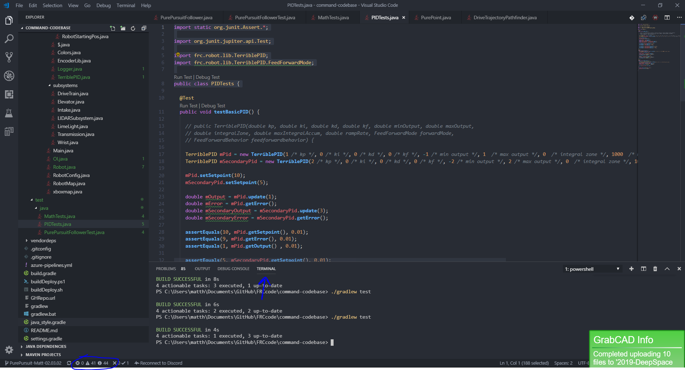]{style="overflow: hidden; display: inline-block; margin: 0.00px 0.00px; border: 0.00px solid #000000; transform: rotate(0.00rad) translateZ(0px); -webkit-transform: rotate(0.00rad) translateZ(0px); width: 624.00px; height: 148.00px;"}

For Windows users, this will be by default a Powershell command prompt.

------------------------------------------------------------------------

Project Index {#h.fselraj97ecd .c7}
=============

        This is an index of suggested projects for sharpening certain
skills. To start a project that [doesn't ]{.c10}require the robot (\*
projects and some \*\* projects), just[[ create a new project in
VSCode](https://www.google.com/url?q=https://wpilib.screenstepslive.com/s/currentCS/m/java/l/1027062-creating-a-robot-program&sa=D&ust=1547844679943000){.c23}]{.c12}.
To start a different project, fork the main repository and work from
there.

[]{.c3}

[Creating and Using a Class]{.c37 .c18} {#h.97uvxf1va9xn .c7}
---------------------------------------

### [Difficulty: \*]{.c16 .c10} {#h.qej7qwbyow5 .c7}

### [Summary]{.c16 .c10} {#h.d6ipha6cqyrn .c7}

[Create and use a basic class.]{.c3}

### [Instructions]{.c16 .c10} {#h.todgdocy5jx8 .c7}

1.  [Create a new project]{.c3}
2.  Create a main file (the one with
    [public]{.c14}[ ]{.c9}[void]{.c14}[ ]{.c9}[main]{.c24
    .c18}[ (String\[\] args){}]{.c9}[)]{.c3}
3.  [Create a new class]{.c3}
4.  [Create a method in that class to print out a random integer
    divisible by a user-inputted integer]{.c3}

<!-- -->

1.  TIP: use a [while]{.c14}[ loop for this]{.c3}

<!-- -->

5.  [Call that class and method from the main method]{.c3}

[]{.c3}

### [Resources]{.c16 .c10} {#h.8pzt7tdrjr37 .c7}

1.  [[User
    Input](https://www.google.com/url?q=https://www.homeandlearn.co.uk/java/user_input.html&sa=D&ust=1547844679946000){.c23}]{.c12}
2.  [[While
    Loops](https://www.google.com/url?q=https://www.homeandlearn.co.uk/java/while_loops.html&sa=D&ust=1547844679947000){.c23}]{.c12}
3.  [[Methods](https://www.google.com/url?q=https://www.homeandlearn.co.uk/java/java_methods.html&sa=D&ust=1547844679947000){.c23}]{.c12}
4.  [[Classes](https://www.google.com/url?q=https://www.homeandlearn.co.uk/java/write_your_own_java_classes.html&sa=D&ust=1547844679948000){.c23}]{.c12}
5.  [This document]{.c3}
6.  Other programmers

[]{.c3}

[DNA to RNA]{.c37 .c18} {#h.mpa2vpi5grwv .c7}
-----------------------

### Difficulty[: \*]{.c16 .c10} {#h.up7lheb10tfk .c7}

### Summary {#h.wdguxa7dcu24 .c7}

Create a program that turns a user-inputted string of DNA protein types
into a string of RNA protein types (a summary on DNA transcription can
be found
[[here](https://www.google.com/url?q=https://www.khanacademy.org/science/biology/gene-expression-central-dogma/transcription-of-dna-into-rna/a/overview-of-transcription&sa=D&ust=1547844679949000){.c23}]{.c12}).

### [Instructions]{.c16 .c10} {#h.64micom6yx4x .c7}

1.  [Create a new project and a file within that project]{.c3}
2.  [In the main method, create a program that takes a user-inputted
    string of DNA proteins, transcribes it to a string of RNA proteins,
    and prints that string]{.c3}
3.  [Try several different strings of DNA to test your program]{.c3}

[]{.c3}

### [Resources]{.c16 .c10} {#h.18cpj047fzho .c7}

1.  [[User
    Input](https://www.google.com/url?q=https://www.homeandlearn.co.uk/java/user_input.html&sa=D&ust=1547844679950000){.c23}]{.c12}
2.  [[Strings](https://www.google.com/url?q=https://www.homeandlearn.co.uk/java/string_variables.html&sa=D&ust=1547844679951000){.c23}]{.c12}
3.  [[Methods](https://www.google.com/url?q=https://www.homeandlearn.co.uk/java/java_methods.html&sa=D&ust=1547844679951000){.c23}]{.c12}
4.  [This document]{.c3}
5.  [Other programmers]{.c3}

[]{.c3}

[Credit Card System]{.c37 .c18} {#h.og1evh829mfo .c7}
-------------------------------

### [Difficulty:\*\*]{.c16 .c10} {#h.j815vp5pectp .c7}

### [Summary]{.c16 .c10} {#h.9sfd2s9am0nj .c7}

[Create a mock credit card system that gives a specific output on
certain user inputs.]{.c3}

### [Instructions]{.c16 .c10} {#h.iw7rd2dv6p32 .c7}

1.  [Create a new project]{.c3}
2.  [Create a new file within that project]{.c3}
3.  [In the main method, create a program that \-- when run \-- gives
    the output shown in the 'Example Output' document]{.c3}
4.  [Try entering the different commands in different orders, and with
    different numbers, to test your program]{.c3}

### [Resources]{.c16 .c10} {#h.mgplx6mf7p9t .c7}

1.  [[Example
    Output](https://www.google.com/url?q=https://docs.google.com/document/d/14x-fy5rrSlGi3GPAsIAWFEylpYliKERgWx_Vlyh42ec/edit?usp%3Dsharing&sa=D&ust=1547844679953000){.c23}]{.c12}
2.  [[User
    Input](https://www.google.com/url?q=https://www.homeandlearn.co.uk/java/user_input.html&sa=D&ust=1547844679954000){.c23}]{.c12}
3.  [[Strings](https://www.google.com/url?q=https://www.homeandlearn.co.uk/java/string_variables.html&sa=D&ust=1547844679954000){.c23}]{.c12}
4.  [[Methods](https://www.google.com/url?q=https://www.homeandlearn.co.uk/java/java_methods.html&sa=D&ust=1547844679955000){.c23}]{.c12}
5.  [This document]{.c3}
6.  [Other programmers]{.c3}

[]{.c3}

[Lines]{.c37 .c18} {#h.o586gttxgfo8 .c7}
------------------

### [Difficulty:\*\*]{.c16 .c10} {#h.m42228xx0qvc .c7}

### [Summary]{.c16 .c10} {#h.d1r7vbmmtr3c .c7}

[Create a program that makes the robot drive in a straight line.]{.c3}

### [Instructions]{.c16 .c10} {#h.n3df57430nit .c7}

1.  [Fork the frc-command-codebase repository]{.c3}
2.  [Create a new command. This is where you will write your code]{.c3}
3.  In [OI.java]{.c9}[, change the line ]{.c3}

[]{#t.3464b1447e8edc319fe38944bf75ee19a3fba54d}[]{#t.30}

+-----------------------------------------------------------------------+
| [auto\_place\_cargo\_cargo\_button.whenPressed(]{.c9}[new]{.c14}[ Run |
| Auto                                                                  |
| (mGoalType.CARGO\_CARGO, AutoMotion.mGoalHeight.LOW));]{.c9}          |
+-----------------------------------------------------------------------+

[to]{.c3}

[]{#t.1efe68adbffbb2411d620501f35f37e1b6bea27b}[]{#t.31}

+-----------------------------------------------------------------------+
| [auto\_place\_cargo\_cargo\_button.whenPressed(]{.c9}[new]{.c14}[ You |
| rCommand());]{.c9}                                                    |
+-----------------------------------------------------------------------+

4.  Go back to your command. Using the [DriveTrain ]{.c9}subsystem by
    calling the object [Robot.drivetrain]{.c9}[, write code that will
    make the robot drive forwards at a set speed]{.c3}
5.  To test your code, [[build and deploy to the
    robot](#h.agj4p6ccl6ga){.c23}]{.c12}[ and press the 'X' button on
    the primary Xbox controller]{.c3}

[]{.c3}

### [Resources]{.c16 .c10} {#h.xx0k4cl5x3mw .c7}

1.  [[WPILib
    Docs](https://www.google.com/url?q=http://first.wpi.edu/FRC/roborio/release/docs/java/index.html&sa=D&ust=1547844679959000){.c23}]{.c12}
2.  [[Chief
    Delphi](https://www.google.com/url?q=https://www.chiefdelphi.com/&sa=D&ust=1547844679960000){.c23}]{.c12}
3.  Existing code
4.  [This document]{.c3}
5.  [Other programmers]{.c3}

[]{.c3}

[Driving]{.c37 .c18} {#h.l2orvunxhhbu .c7}
--------------------

### [Difficulty: \*\*\*]{.c16 .c10} {#h.9yr0dkj0sd0f .c7}

### [Summary]{.c16 .c10} {#h.u2gaebqfy3f0 .c7}

[Create a command that will control the robot drivetrain based on input
from a single joystick.]{.c3}

### [Instructions]{.c16 .c10} {#h.9bjvdzpqc5os .c7}

1.  [Fork the frc-command-codebase repository]{.c3}
2.  [Create a new command. This is where you will write your code]{.c3}
3.  In [DriveTrain.java]{.c9}[, change the line ]{.c3}

[]{#t.8b535474d0b56f053fd4a42a801befe68ed685cf}[]{#t.32}

+-----------------------------------------------------------------------+
| [setDefaultCommand(]{.c9}[new]{.c14}[ ArcadeDrive());]{.c9}           |
+-----------------------------------------------------------------------+

[        to]{.c3}

[]{#t.fc132e2669d77bc721ec4673ae39df8f2ec8a849}[]{#t.33}

+-----------------------------------------------------------------------+
| [setDefaultCommand(]{.c9}[new]{.c14}[ YourCommand());]{.c9}           |
+-----------------------------------------------------------------------+

4.  Go back to your command. Using the [DriveTrain]{.c9} subsystem by
    calling the object [Robot.drivetrain]{.c9} and
    the[ OI]{.c9} functions by calling the object [Robot.m\_oi]{.c9}[,
    write code that will make the robot drive based on the angles of the
    joystick]{.c3}
5.  To test your code, [[build and deploy to the
    robot](#h.agj4p6ccl6ga){.c23}]{.c12}[ and move the joysticks on the
    primary Xbox controller]{.c3}

[]{.c3}

### [Resources]{.c16 .c10} {#h.b4wokm1wvc7 .c7}

1.  [[WPILib
    Docs](https://www.google.com/url?q=http://first.wpi.edu/FRC/roborio/release/docs/java/index.html&sa=D&ust=1547844679965000){.c23}]{.c12}
2.  [[Chief
    Delphi](https://www.google.com/url?q=https://www.chiefdelphi.com/&sa=D&ust=1547844679965000){.c23}]{.c12}
3.  Existing code
4.  [This document]{.c3}
5.  [Other programmers]{.c3}

[]{.c3}

[Elevator]{.c37 .c18} {#h.fgsbhq4ypsqi .c7}
---------------------

### [Difficulty:\*\*\*]{.c16 .c10} {#h.a74hwps8666f .c7}

### Summary {#h.bctnkvq437pe .c7}

[Create a command that will set the elevator to a predefined height when
a button on the secondary controller is pressed. Be sure not to use a
button that is already bound to another command!]{.c3}

### [Instructions]{.c16 .c10} {#h.szi2wu6l5a36 .c7}

1.  [Fork the codebase]{.c3}
2.  [Create a new command. In this command, add code that will make the
    elevator go up to a specific height once when the command is
    called]{.c3}
3.  In [OI.java]{.c9}[, bind one of the buttons on the secondary Xbox
    controller to your command]{.c3}
4.  To test your code, [[build and
    deploy](#h.agj4p6ccl6ga){.c23}]{.c12} to the robot[, then press the
    button you bound your command to]{.c3}

### [Resources]{.c16 .c10} {#h.v1rsgernl0jz .c7}

1.  [[WPILib
    Docs](https://www.google.com/url?q=http://first.wpi.edu/FRC/roborio/release/docs/java/index.html&sa=D&ust=1547844679968000){.c23}]{.c12}
2.  [[Chief
    Delphi](https://www.google.com/url?q=https://www.chiefdelphi.com/&sa=D&ust=1547844679968000){.c23}]{.c12}
3.  [Existing code]{.c3}
4.  [This document]{.c3}
5.  [Other programmers]{.c3}

[]{.c3}

[Command Square]{.c37 .c18} {#h.sr55z4hn3bxs .c7}
---------------------------

### [Difficulty:\*\*\*\*]{.c16 .c10} {#h.9kx78aqjf1o8 .c7}

### [Summary]{.c16 .c10} {#h.4npxto54aq3a .c7}

[Create a group of commands that will make the robot drive in a square
with user-inputted area.]{.c3}

### [Instructions]{.c16 .c10} {#h.6g0frz6n454m .c7}

1.  [Fork the codebase]{.c3}
2.  [Create a new command group]{.c3}
3.  Using the [DriveDistance ]{.c9}[command and also math, create a
    command group that will make the robot drive in a square that has an
    area that can be changed from SmartDashboard/Shuffleboard]{.c3}

<!-- -->

1.  Note: Add things to SmartDashboard/Shuffleboard from
    [Robot.java]{.c9}

<!-- -->

4.  To test your code, [[build and
    deploy](#h.agj4p6ccl6ga){.c23}]{.c12}[ to the robot, then change the
    value for the area, run your command group, and check the area of
    the resulting square]{.c3}

### [Resources]{.c16 .c10} {#h.qrlvbbk5el0t .c7}

1.  [[WPILib
    Docs](https://www.google.com/url?q=http://first.wpi.edu/FRC/roborio/release/docs/java/index.html&sa=D&ust=1547844679971000){.c23}]{.c12}
2.  [[Chief
    Delphi](https://www.google.com/url?q=https://www.chiefdelphi.com/&sa=D&ust=1547844679972000){.c23}]{.c12}
3.  [Existing code]{.c3}
4.  [This document]{.c3}
5.  [Other programmers]{.c3}

[]{.c3}

[Placement]{.c18 .c37} {#h.e9o91oi8t9dt .c7}
----------------------

### [Difficulty:\*\*\*\*\*]{.c16 .c10} {#h.935fr5ku62wo .c7}

### [Summary]{.c16 .c10} {#h.5leqkdq1me8v .c7}

[Create a program that will place a game piece in a goal when an
operator presses a button.]{.c3}

### [Instructions]{.c16 .c10} {#h.3w18d1rtnbx3 .c7}

1.  [If you'll notice the five-star difficulty rating, this one is
    hard]{.c3}
2.  [For that reason, we're not going to give you any instructions]{.c3}
3.  [Good luck!]{.c3}

[]{.c3}

### [Resources]{.c16 .c10} {#h.89ahv0l6ms1o .c7}

1.  [[WPILib
    Docs](https://www.google.com/url?q=http://first.wpi.edu/FRC/roborio/release/docs/java/index.html&sa=D&ust=1547844679975000){.c23}]{.c12}
2.  [[Chief
    Delphi](https://www.google.com/url?q=https://www.chiefdelphi.com/&sa=D&ust=1547844679975000){.c23}]{.c12}
3.  [Existing code]{.c3}
4.  [This document]{.c3}
5.  [Other programmers]{.c3}

[]{.c3}

[]{.c3}

[]{.c3}

[]{.c3}

[Jump In!]{.c37 .c18} {#h.fo2nzrb0r1v9 .c7}
---------------------

        Pick an issue from the [[codebase
repository](https://www.google.com/url?q=https://github.com/BREAD5940/frc-java-command-codebase/issues&sa=D&ust=1547844679977000){.c23}
]{.c12}[(preferably one marked "Needs Assignee", "Good First Issue",
and/or "Help Wanted"), and work on it! Be sure to ask for help from
others if you need it.]{.c3}

[]{.c3}

[]{.c3}

[]{.c3}

::: {.c45}
[\[a\]](#cmnt_ref1){#cmnt1}[ok I know I\'m missing stuff but I don\'t
know what]{.c30}
:::

::: {.c45}
[\[b\]](#cmnt_ref2){#cmnt2}[Did you include building the tools for
WPI?]{.c30}
:::

::: {.c45}
[\[c\]](#cmnt_ref3){#cmnt3}[no, sorry]{.c30}

[that\'s just the NI stuff, right?]{.c30}
:::

::: {.c45}
[\[d\]](#cmnt_ref4){#cmnt4}[screenshots]{.c30}
:::

::: {.c45}
[\[e\]](#cmnt_ref5){#cmnt5}[Add a section for the this keyword]{.c30}
:::

::: {.c45}
[\[f\]](#cmnt_ref6){#cmnt6}[I kinda feel like this is wrong]{.c30}
:::

::: {.c45}
[\[g\]](#cmnt_ref7){#cmnt7}[\_Marked as resolved\_]{.c30}
:::

::: {.c45}
[\[h\]](#cmnt_ref8){#cmnt8}[\_Re-opened\_]{.c30}
:::

::: {.c45}
[\[i\]](#cmnt_ref9){#cmnt9}[Maybe leave this out since no one has used
shuffleboard yet]{.c30}
:::

::: {.c45}
[\[j\]](#cmnt_ref10){#cmnt10}[I may be wrong, but aren\'t they
channels?]{.c30}
:::

::: {.c45}
[\[k\]](#cmnt_ref11){#cmnt11}[google, then explain]{.c30}
:::
